## 第一章

* 在jsx中输入{}进入javascript模式


```react
import { useEffect, useState } from "react";
import "./styles.css";

export default function App() {
  const [advice, setAdvice] = useState("");
  const [count, setCount] = useState(0);
  async function getAdvice() {
    const res = await fetch("https://api.adviceslip.com/advice");
    const data = await res.json();
    console.log(data.slip.advice);
    setAdvice(data.slip.advice);
    setCount((c) => c + 1);
  }

  useEffect(function () {
    getAdvice();
  }, []);
  return (
    <div className="App">
      <h1>{advice}</h1>
      <button onClick={getAdvice}>Get advice</button>
      <Message count={count} />
    </div>
  );
}

function Message(props) {
  return (
    <p>
      You have read
      <strong>{props.count}</strong> pieces of advice
    </p>
  );
}

```


* 2010前是服务端渲染为主，像是wordpress，next，remix等都是，前端是jQuery库。
* 2010后改为客户端渲染，网页也改为叫单页应用。


* 前端的工作室获取数据和显示数据，
* 单页应用中如何保持数据和UI始终同步是一个难题

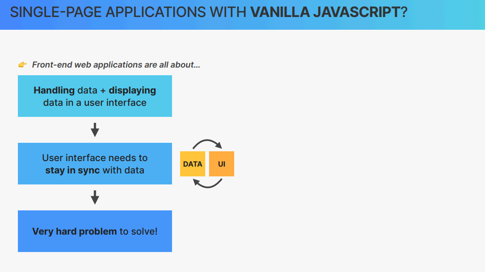


* piece of data=piece of state
* 原生js中：在处理复杂应用时，对dom的操作代码会很多，导致意大利面条式（屎山Spaghetti）的代码。
* 数据直接存储在dom结构中，被全局可访问，容易造成bug。


* 前端框架为什么存在

  * 保证数据和UI同步
  * 正确的代码架构，让大家更好的编程，避免屎山代码
  * 给予团队统一的编码方式

  

安装插件

* ESLint
* prettier
* Material Icon Theme
* Quokka.js是为了纯js的运行

配置auto save

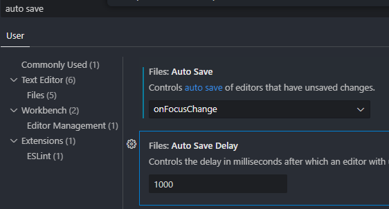


配置default formatter

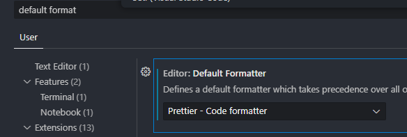


配置format on save

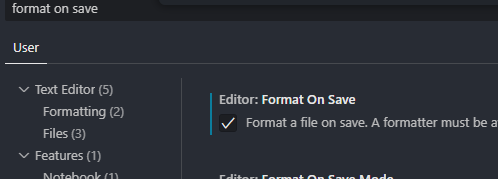


配置eslint

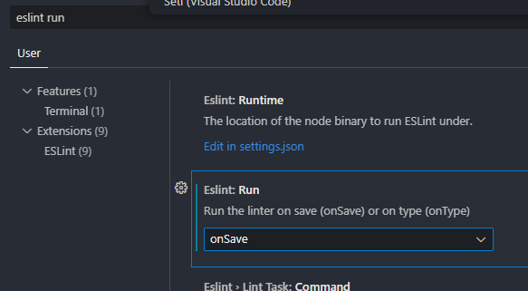


配置snippet

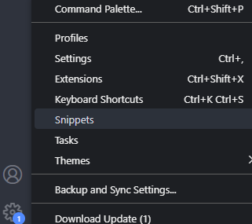

创建文件

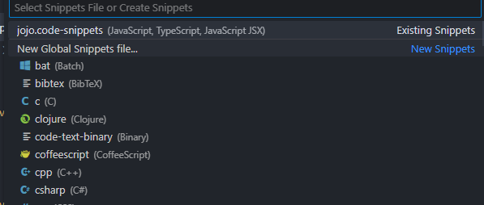

粘贴：

```
{
  "Print to console": {
    "prefix": "cl",
    "scope": "javascript,typescript,javascriptreact",
    "body": ["console.log($1)"],
    "description": "console.log"
  },
  "reactComponent": {
    "prefix": "rfc",
    "scope": "javascript,typescript,javascriptreact",
    "body": [
      "function ${1:${TM_FILENAME_BASE}}() {",
      "\treturn (",
      "\t\t<div>",
      "\t\t\t$0",
      "\t\t</div>",
      "\t)",
      "}",
      "",
      "export default ${1:${TM_FILENAME_BASE}}",
      ""
    ],
    "description": "React component"
  },
  "reactStyledComponent": {
    "prefix": "rsc",
    "scope": "javascript,typescript,javascriptreact",
    "body": [
      "import styled from 'styled-components'",
      "",
      "const Styled${TM_FILENAME_BASE} = styled.$0``",
      "",
      "function ${TM_FILENAME_BASE}() {",
      "\treturn (",
      "\t\t<Styled${TM_FILENAME_BASE}>",
      "\t\t\t${TM_FILENAME_BASE}",
      "\t\t</Styled${TM_FILENAME_BASE}>",
      "\t)",
      "}",
      "",
      "export default ${TM_FILENAME_BASE}",
      ""
    ],
    "description": "React styled component"
  }
}
```


* 纯react实现:

```js
<!DOCTYPE html>
<html lang="en">
  <head>
    <meta charset="UTF-8" />
    <meta name="viewport" content="width=device-width, initial-scale=1.0" />
    <title>Hello React!</title>
  </head>
  <body>
    <div id="root"></div>

    <script src="https://unpkg.com/react@18/umd/react.development.js"></script>
    <script src="https://unpkg.com/react-dom@18/umd/react-dom.development.js"></script>
    <script>
      function App() {
        // const time = new Date().toLocaleDateString();
        const [time, setTime] = React.useState(new Date().toLocaleDateString());

        React.useEffect(function () {
          setInterval(function () {
            setTime(new Date().toLocaleDateString());
          }, 1000);
        }, []);

        return React.createElement("header", null, `Hello React! It's ${time}`);
      }

      const root = ReactDOM.createRoot(document.getElementById("root"));
      root.render(React.createElement(App));
    </script>
  </body>
</html>

```


* React官网 https://react.dev/  着重关注Learn和Reference章节，Escape Hatches章节


* Create-react-app使用webpack已经过时。自动集成ESLint，Prettier。页面刷新慢。
* 使用vite构建react，需要手动集成ESLint，页面刷新快。

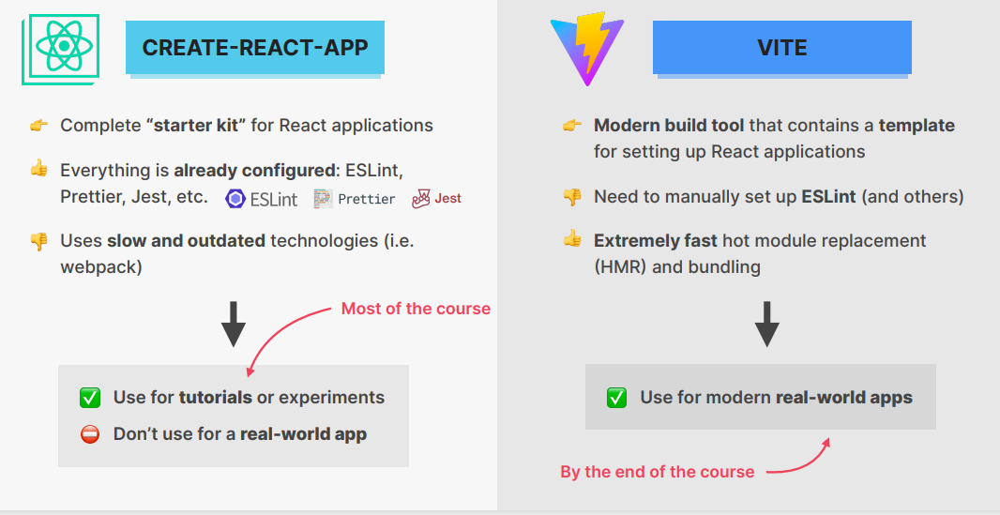


```
npx create-react-app@5 pizza-menu
```


* js基础


* 对象解构

```js
// const title = book.title;
// const author = book.author;
const { title, author } = book;
```


* 数组解构

```js
// const primaryGenre = genres[0];
// const secondaryGenre = genres[1];
//依次获得数组的第一个元素，第二个元素，第三个元素...
const [primaryGenre, secondaryGenre, aaa, bbb] = genres;
console.log(primaryGenre, secondaryGenre, aaa, bbb);

//依次第三个元素和之后的元素放到aaa的数组里面
const [primaryGenre, secondaryGenre, ...aaa] = genres;
console.log(primaryGenre, secondaryGenre, aaa);

//数组展开到新的数组
const newGenres = [...genres, "epic fantasy"];
newGenres;

//对象展开到新的对象
const updatedBook = { ...book, moviePublicationDate: "2001-12-19" };

//对象展开到新的对象，还可以覆盖原对象中的子项
const updatedBook = { ...book, moviePublicationDate: "2001-12-19",id:3 };


```


* 字符串模板字面值:``${}``里可以放任何js表达式。

```js
const summary = `${title} a ${pages} book ${2 + 4} ${
  publicationDate.split("-")[0]
}`;
```


* 三元运算符

```js
const pagesRange = pages > 1000 ? "over a thousand" : "less than 1000";
pagesRange;
console.log(`The book has ${pagesRange} pages`);
```


* 箭头函数

```js
//普通函数
function getYear(str) {
  return str.split("-")[0];
}

//一句话箭头函数，可以省略{}和return
const getYear = (str) => str.split("-")[0];

//一般的箭头函数，可以省略{}和return
const getYear = (str) => {
  return str.split("-")[0];
};

console.log(getYear(publicationDate));
```


* 短路语法

```js
//当值为: 0, '', null, undefined时，为false，其他值为true
//&&，当第一个元素为假值时，第二个元素被短路
console.log("jojo" && "Some str");
console.log(0 && "Some str1");

//||，当第一个元素为真值时，第二个元素被短路
//||，当第一个元素为假值时，第二个元素执行
console.log(true || "Some string");
console.log(false || "Some string");

console.log(book.translations.spanish);

const spanishTranslation = book.translations.spanish || "NOT TRANSLATED";
spanishTranslation;

console.log(book.reviews.librarything.reviewsCount);
const countWrong = book.reviews.librarything.reviewsCount || "no data";
countWrong;

//??仅第一个元素为null或者undefined，第二原始执行
//falsy: null, undefined
const count = book.reviews.librarything.reviewsCount ?? "no data";
count;
```


* 可选链操作符
* ?代表如果librarything不存在，则立即返回undefine，而不会继续找reviewsCount而报错

```js
const count = book.reviews.librarything?.reviewsCount;
```


* map方法
* 只能用于数组，根据规则，创建一个新的数组

```js
//创建一个一个新数组，数组的每一项都是book.title
const titles = books.map((book) => book.title);
console.log(titles);

//创建一个一个新数组，数组的每一项都是一个对象
/*
{
  title: book.title,
  author: book.author,
  reviewsCount: getTotalReviewCount(book),
}
*/
//
const essentialData = books.map((book) => ({
  title: book.title,
  author: book.author,
  reviewsCount: getTotalReviewCount(book),
}));
```


* filter过滤器
* 只能用于数组，filter过滤器从数组中选出符合条件的项，构造成新的数组。

```js

const longBooks = books
  .filter((book) => book.pages > 500)
  .filter((book) => book.hasMovieAdaptation);
longBooks;

const adventureBooks = books
  .filter((book) => book.genres.includes("adventure"))
  .map((book) => book.title);
adventureBooks;
```


* reduce方法
* 只能用于数组，reduce方法将数组中的某一项值进行数学运算合成一个值sum然后返回给pagesAllBooks

```js
const pagesAllBooks = books.reduce((sum, book) => sum + book.pages, 0);
```


* sort方法
* 只能用于数组，sort方法按照规则对数组进行排序，会改变原来的数组，配合,slice使用则不会更改原来的数组。

```js
const arr = [3, 7, 1, 9, 6];
//升序
const sorted = arr.slice().sort((a, b) => a - b);
sorted;//[ 1, 3, 6, 7, 9 ]
arr;
//降序
const sorted1 = arr.slice().sort((a, b) => b - a);
sorted1;//[ 9, 7, 6, 3, 1 ]
arr;

//按照页数降序排列
const sortedByPages = books.slice().sort((a, b) => b.pages - a.pages);
sortedByPages;
```


* 数组的增删改实现

```js
//1 add book
const newBook = {
  id: 6,
  title: "Harry Potter and the Chamber of Secrets",
  author: "J.K. Rowling",
};
const booksAfterAdd = [...books, newBook];
booksAfterAdd;

//2 delete book
const booksAfterDelete = booksAfterAdd.filter((book) => book.id !== 3);
booksAfterDelete;

//3 update book 
//将id==1的book里的pages改为1211
const booksAfterUpdate = booksAfterDelete.map((book) =>
  book.id === 1 ? { ...book, pages: 1211 } : book
);
booksAfterUpdate;
```


* 异步javascript
* 处理promise，then：当收到数据后执行then里面的回调函数。

```js
fetch("https://jsonplaceholder.typicode.com/todos")
  .then((res) => res.json())//json也返回一个promise
  .then((data) => console.log(data));//处理json的promise
console.log("jojo");//这句话会先打印
```


* JSX：类似于html的语法会被翻译成js（BABEL工具）
* 纯react中不能使用JSX

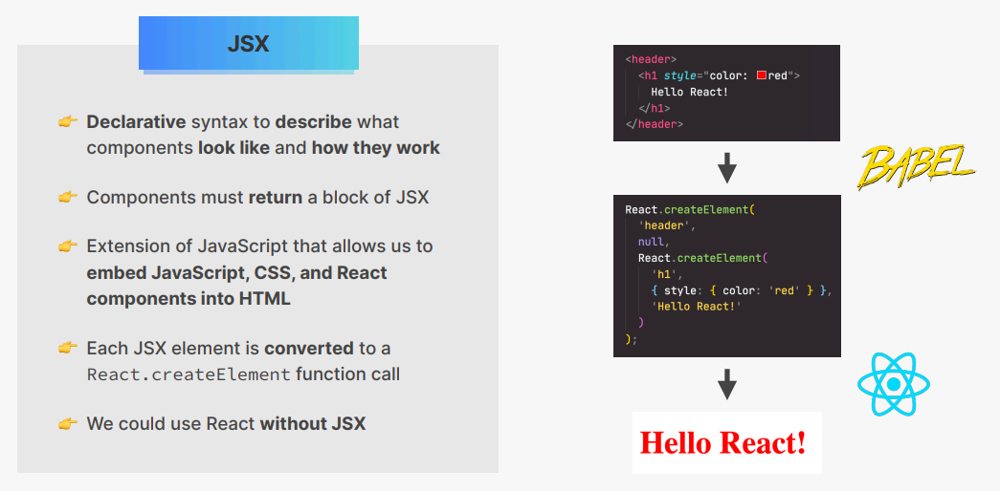

* 命令式：手动操作DOM来更新UI。
* 声明式：ui和数据自动映射和更新。

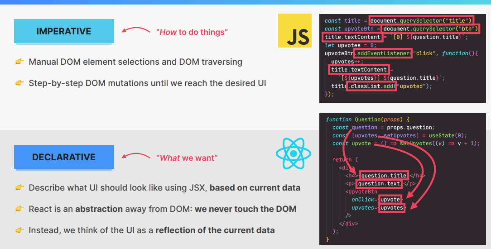


* 在react中js和html都是写在jsx中的，原因是js和html高度协同工作，没必要分开写了。
* react使用组件为基本单位
* 一个组件里包含数据（js）和逻辑（js）和外观（html和css）

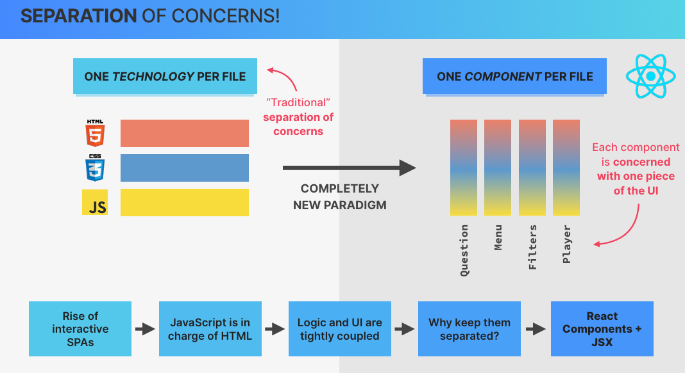


* 使用内联css

```js
function Header() {
  const style = { color: "red", fontSize: "48px", textTransform: "uppercase" };
  return <h1 style={style}>Fast React Pizza Co.</h1>;
}
```


* props传参
* props传参支持单值，数组，对象，函数，还有甚至是其他组件

```js
<Pizza
    name="Pizza Funghi"
    ingredient="Tomato,mushrooms"
    price={12}
    photoName="pizzas/funghi.jpg"
/>
            
function Pizza(props) {
  console.log(props);
  return (
    <div className="pizza">
      
      <div>
        <h3>{props.name}</h3>
        <p>{props.ingredients}</p>
        <span>{props.price + 3}</span>
      </div>
    </div>
  );
}

//直接解构
function Pizza({ pizzaObj }) {
  console.log(pizzaObj);

  if (pizzaObj.soldOut) return null;
  return (
    <li className="pizza">
      
      <div>
        <h3>{pizzaObj.name}</h3>
        <p>{pizzaObj.ingredients}</p>
        <span>{pizzaObj.price + 3}</span>
      </div>
    </li>
  );
}

```


* react使用单向数据流：从父到子

  * 让应用更加好预测
  * 让应用方便debug，
  * 更加好的性能

  

* 挑战1

```js
import { StrictMode } from "react";
import { createRoot } from "react-dom/client";
import "./styles.css";

function Avatar() {
  return (
    <div>
      
    </div>
  );
}
function Intro(params) {
  return (
    <div>
      <h1>Jonas </h1>
      <p>
        Full-stack web developer and teacher at Udemy. When not coding or
        preparing a course, I like to play board games, to cook (and eat), or to
        just enjoy the Portuguese sun at the beach.
      </p>
    </div>
  );
}

function Skill(props) {
  return (
    <div className="skill" style={{ backgroundColor: props.backgroundColor }}>
      {props.name}
    </div>
  );
}

function SkillList() {
  return (
    <div className="skill-list">
      <Skill name="HTML+CSS" backgroundColor="blue" />
      <Skill name="JavaScript" backgroundColor="yellow" />
    </div>
  );
}

function App() {
  return (
    <div className="card">
      <Avatar />
      <div className="data">
        <Intro />
        {/* Should contain one Skill component
        for each web dev skill that you have,
        customized with props */}
        <SkillList />
      </div>
    </div>
  );
}

const rootElement = document.getElementById("root");
const root = createRoot(rootElement);

root.render(
  <StrictMode>
    <App />
  </StrictMode>
);

```


* JSX中不允许使用if和else，但{}中可以使用变量，数组，对象，map，三元运算符。


* 在使用map方法时，必须传入唯一的key，不然会告警

```jsx
<div>
    {pizzaData.map((pizza) => (
      <Pizza pizzaObj={pizza} key={pizza.name} />
    ))}
</div>
```


* true和false不会被渲染，但是0会被渲染

```jsx
  {isOpen && (
    <div className="order">
      <p>
        We're open until until {closeHour}:00. Come vist us or order online.
      </p>
      <button className="btn">Order</button>
    </div>
  )}

  const pizzas = [];
  const numPizzas = pizzas.length;
  return (
    <div className="menu">
      <h2>Out menu</h2>
      {numPizzas && (
        <ul className="pizzas">
          {pizzas.map((pizza) => (
            <Pizza pizzaObj={pizza} key={pizza.name} />
          ))}
        </ul>
      )
```


* 使用&&条件渲染,numPizzas可以是javascript变量，不一定要是useState变量

```jsx
  {numPizzas && (
    <ul className="pizzas">
      {pizzas.map((pizza) => (
        <Pizza pizzaObj={pizza} key={pizza.name} />
      ))}
    </ul>
  )
```

* 使用三元运算符条件渲染

```jsx
  {numPizzas > 0 ? (
    <ul className="pizzas">
      {pizzas.map((pizza) => (
        <Pizza pizzaObj={pizza} key={pizza.name} />
      ))}
    </ul>
  ) : (
    <p>We're still working on our menu</p>
  )}
```

* 使用多次return进行条件渲染

```jsx
if (!isOpen)
    return (
      <p>
        !We're happy to welcome you between {openHour}:00 - {closeHour}:00
      </p>
);

return (
    <footer className="footer"></footer>
)
```

```jsx
function Pizza(props) {
  console.log(props);

  if (props.pizzaObj.soldOut) return null;
  return (
    <li className="pizza">
      
      <div>
        <h3>{props.pizzaObj.name}</h3>
        <p>{props.pizzaObj.ingredients}</p>
        <span>{props.pizzaObj.price + 3}</span>
      </div>
    </li>
  );
}
```


* React Fragments

  正常就使用<>和</>

```jsx
    <>
      <Header />
      <Menu />
      <Footer />
    </>
```

​	当你需要在map中使用时，要加key，必须使用React.Fragment带key

```jsx
<React.Fragment key='123'>
  <p>
    Authenitc Italian cuisine. 6 creative dishes to choose from. All
    from our stone oven, all orginic, all delicious.
  </p>
  <ul className="pizzas">
    {pizzas.map((pizza) => (
      <Pizza pizzaObj={pizza} key={pizza.name} />
    ))}
  </ul>
</React.Fragment>
```


* ``套${},在套三元运算符

```jsx
  return (
    <li className={`pizza ${pizzaObj.soldOut ? "sold-out" : ""}`}>
      
      <div>
        <h3>{pizzaObj.name}</h3>
        <p>{pizzaObj.ingredients}</p>
        <span>{pizzaObj.soldOut ? "SOLD OUT" : pizzaObj.price}</span>
      </div>
    </li>
  );
```


* 挑战2：

```js
import { StrictMode } from "react";
import { createRoot } from "react-dom/client";
import "./styles.css";

function Avatar() {
  return (
    <div>
      
    </div>
  );
}
function Intro(params) {
  return (
    <div>
      <h1>Jonas </h1>
      <p>
        Full-stack web developer and teacher at Udemy. When not coding or
        preparing a course, I like to play board games, to cook (and eat), or to
        just enjoy the Portuguese sun at the beach.
      </p>
    </div>
  );
}

const skillData = [
  {
    skill: "HTML+CSS",
    level: "advanced",
    color: "blue",
  },
  {
    skill: "JavaScript",
    level: "beginner",
    color: "red",
  },
  {
    skill: "React",
    level: "inter",
    color: "yellow",
  },
];

function Skill({ skill, level, color }) {
  return (
    <div className="skill" style={{ backgroundColor: color }}>
      <span>{skill}</span>
      <span>
        {level === "inter" ? "👌" : level === "beginner" ? "👏" : "✔"}
      </span>
    </div>
  );
}

function SkillList() {
  return (
    <div className="skill-list">
      {skillData.map((skill) => (
        <Skill skill={skill.skill} color={skill.color} level={skill.level} />
      ))}
    </div>
  );
}

function App() {
  return (
    <div className="card">
      <Avatar />
      <div className="data">
        <Intro />
        {/* Should contain one Skill component
        for each web dev skill that you have,
        customized with props */}
        <SkillList />
      </div>
    </div>
  );
}

const rootElement = document.getElementById("root");
const root = createRoot(rootElement);

root.render(
  <StrictMode>
    <App />
  </StrictMode>
);
```


* state
  * 是组件在生命周期中可以维持的数据
  * 是组件的记忆
  * 当state更新时，会重新渲染UI界面


* 使用use开头的函数是Hook函数


* useState不能在非react函数中调用，不能在if中调用，不要在set函数之外去更新。


* react会监视useState的变量，当变量更新时，react会重新渲染这个组件一次。

  

* 使用React 插件显示useState的状态，并且可以在线修改：

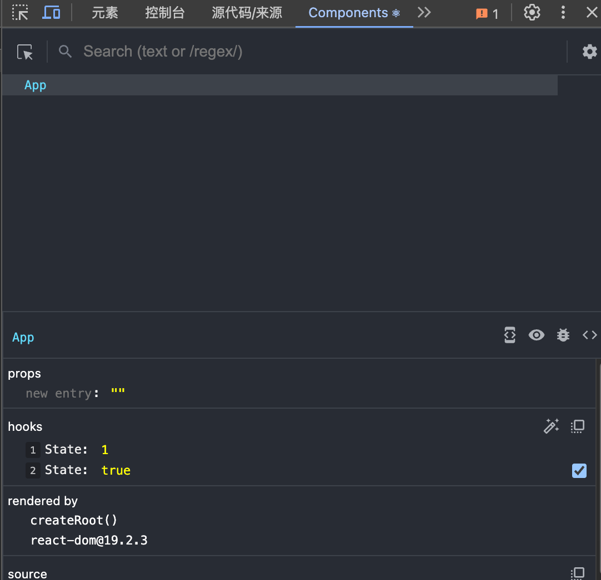


* 更新useState的最佳办法：

将

```js
setStep(step+1);
```

改为：

```js
setStep((s) => s + 1);
```


* 如果不需要促发页面渲染的变量，不要使用useState创建。


* 使用原生js实现同样的功能

```html
<!DOCTYPE html>
<html lang="en">
  <head>
    <meta charset="UTF-8" />
    <meta http-equiv="X-UA-Compatible" content="IE=edge" />
    <meta name="viewport" content="width=device-width, initial-scale=1.0" />
    <link rel="stylesheet" type="text/css" href="../src/style.css" />
    <title>Vanilla JS steps</title>
  </head>
  <body>
    <div class="steps">
      <div class="numbers">
        <div class="step-1">1</div>
        <div class="step-2">2</div>
        <div class="step-3">3</div>
      </div>

      <p class="message"></p>

      <div class="buttons">
        <button class="previous">Previous</button>
        <button class="next">Next</button>
      </div>
    </div>

    <script>
      const messages = [
        'Learn React ⚛️',
        'Apply for jobs 💼',
        'Invest your new income 🤑',
      ];

      // Selecting DOM elements
      const step1 = document.querySelector('.step-1');
      const step2 = document.querySelector('.step-2');
      const step3 = document.querySelector('.step-3');
      const message = document.querySelector('.message');
      const btnPrevious = document.querySelector('.previous');
      const btnNext = document.querySelector('.next');

      // "State"
      let step = 1;

      // Manually updating the DOM: changing text content and adding/removing classes (imperative approach)
      const updateUIValues = function () {
        message.textContent = `Step ${step}: ${messages[step - 1]}`;

        if (step >= 1) step1.classList.add('active');
        else step1.classList.remove('active');

        if (step >= 2) step2.classList.add('active');
        else step2.classList.remove('active');

        if (step >= 3) step3.classList.add('active');
        else step3.classList.remove('active');
      };

      // Initial setup
      updateUIValues();

      // Manually attaching event listeners
      btnPrevious.addEventListener('click', function () {
        if (step > 1) step -= 1;
        updateUIValues();
      });

      btnNext.addEventListener('click', function () {
        if (step < 3) step += 1;
        updateUIValues();
      });
    </script>
  </body>
</html>

```


* 挑战1

```js
function Counter() {
  const [step, setStep] = useState(1);
  const [count, setCount] = useState(0);

  const today = new Date();
  const time = new Date(today);
  time.setDate(today.getDate() + count);
  const isoDate = time.toLocaleDateString("en-US", {
    year: "numeric",
    month: "short",
    day: "numeric",
  });
  console.log(isoDate);
  function stepSub() {
    setStep((s) => s - 1);
  }

  function stepAdd() {
    setStep((s) => s + 1);
  }

  function countSub() {
    setCount((s) => s - step);
  }

  function countAdd() {
    setCount((s) => s + step);
  }
  return (
    <div>
      <div>
        <button onClick={stepSub}>-</button>
        <span>Step:{step}</span>
        <button onClick={stepAdd}>+</button>
      </div>
      <div>
        <button onClick={countSub}>-</button>
        <span>Count:{count}</span>
        <button onClick={countAdd}>+</button>
      </div>
      {count === 0 && <span>Today </span>}
      {count > 0 && <span>{count} days from today </span>}
      {count < 0 && <span>{-count} days ago was </span>}
      <span>is {isoDate}</span>
    </div>
  );
}
```


* 根据条件选择style

```js
function Item({ item }) {
  return (
    <li>
      <span style={item.packed ? { textDecoration: "line-through" } : {}}>
        {item.quantity} {item.description}
      </span>
      <button>"❌"</button>
    </li>
  );
}
```


* 使用Array.from创建一个[1...20]的数组，然后使用map进行映射

```html
  <select>
    {Array.from({ length: 20 }, (_, i) => i + 1).map((num) => (
      <option value={num} key={num}>
        {num}
      </option>
    ))}
  </select>
```


* 表单select和input数据同步的实现：

```js
function Form() {
  const [description, setDescription] = useState("");
  const [select, setSelect] = useState("");
  function handleSubmit(e) {
    e.preventDefault();
    console.log(e);
  }

  return (
    <form className="add-form" onSubmit={handleSubmit}>
      <h3>What do you need for your trip?</h3>
      <select value={select} onChange={(e) => setSelect(e.target.value)}>
        {Array.from({ length: 20 }, (_, i) => i + 1).map((num) => (
          <option value={num} key={num}>
            {num}
          </option>
        ))}
      </select>
      <input
        type="text"
        placeholder="Item..."
        value={description}
        onChange={(e) => setDescription(e.target.value)}
      />
      <button>Add</button>
    </form>
  );
}
```


* 如果把state作为props参数传入，当state更新时，父组件和子组件都会重新刷新页面。


* 挑战2
* 使用滑动条

```ts
function Counter() {
  const [step, setStep] = useState(1);
  const [count, setCount] = useState(0);

  const today = new Date();
  const time = new Date(today);
  time.setDate(today.getDate() + count);
  const isoDate = time.toLocaleDateString("en-US", {
    year: "numeric",
    month: "short",
    day: "numeric",
  });
  console.log(isoDate);

  function countSub() {
    setCount((s) => s - step);
  }

  function countAdd() {
    setCount((s) => s + step);
  }
  return (
    <>
      <div>
        <div>
          <input
            value={step}
            type="range"
            min="0"
            max="10"
            onChange={(e) => setStep(Number(e.target.value))}
          />
          {step}
        </div>
        <div>
          <button onClick={countSub}>-</button>
          {/* <span>Count:{count}</span> */}
          <input
            value={count}
            onChange={(e) => setCount(Number(e.target.value))}
          ></input>
          <button onClick={countAdd}>+</button>
        </div>
        {count === 0 && <span>Today </span>}
        {count > 0 && <span>{count} days from today </span>}
        {count < 0 && <span>{-count} days ago was </span>}
        <span>is {isoDate}</span>
      </div>

      {(count !== 0 || step != 1) && (
        <button
          onClick={() => {
            setCount(0);
            setStep(1);
          }}
        >
          Reset
        </button>
      )}
    </>
  );
}
```


* REACT的思维
  * 将UI拆分成组件，建立组件树
  * 构建静态版本，没有state
  * 思考state
    * 什么时候使用state
    * 使用本地还是全局
    * state变量放在哪里
  * 建立数据流
    * 单向数据流
    * 子组件向父组件通信
    * 访问全局状态


* 全局状态
  * 使用Context API
  * 使用Redux
  
  

* 什么时候创建state，创建后放在哪里？

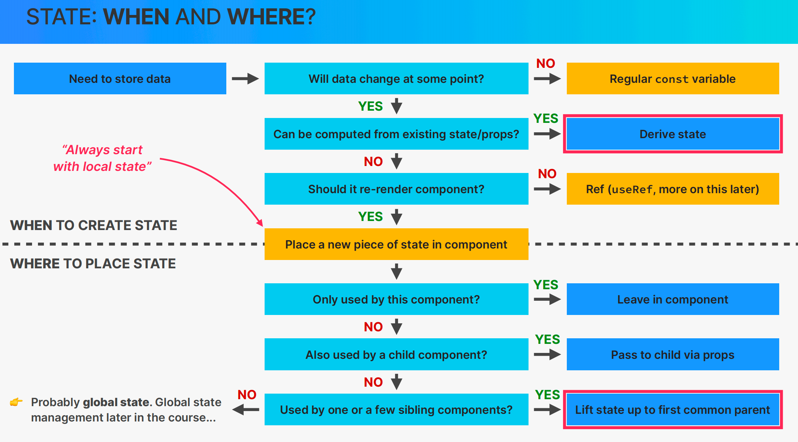


* input实现checkbox

```jsx
  <input
    type="checkbox"
    value={item.packed}
    onChange={() => onToggleItem(item.id)}
  />
```


* 派生状态：如果一个状态可以从另一个状态计算出来，那这个状态可以用const创建，从而防止页面多次渲染。

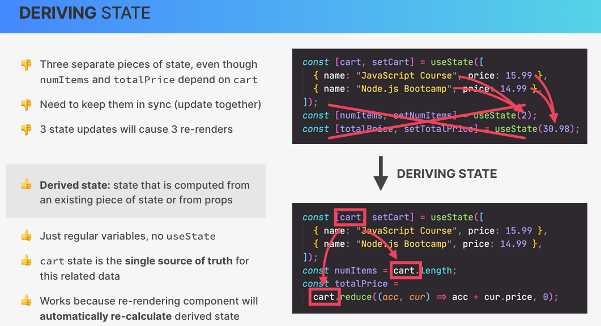


* 提前退出，避免多余的计算

```js

function Stats({ items }) {
  if (!items.length)
    return (
      <footer className="stats">
        <em>Start adding some items to your packing list😏</em>
      </footer>
    );

  const numItems = items.length;
  const numPacked = items.filter((item) => item.packed).length;
  const percentage = Math.round((numPacked / numItems) * 100);
  return (
    <footer className="stats">
      <em>
        {percentage === 100
          ? "You gor everything! Ready to go !"
          : `🚩You have ${numItems} items on your list, add you already packed
                ${numPacked} (${percentage}%)`}
      </em>
    </footer>
  );
}
```


* 一个选择列表的实现，slice重新创建新的数组：

```js
function PackingList({ items, onDeleteItem, onToggleItem }) {
  const [sortBy, setSortBy] = useState("input");

  let sortedItems;

  if (sortBy === "input") sortedItems = items;

  if (sortBy === "description")
    sortedItems = items
      .slice()
      .sort((a, b) => a.description.localeCompare(b.description));

  if (sortBy === "packed")
    sortedItems = items
      .slice()
      .sort((a, b) => Number(a.packed) - Number(b.packed));

  return (
    <div className="list">
      <ul>
        {sortedItems.map((item) => (
          <Item
            item={item}
            onDeleteItem={onDeleteItem}
            key={item.id}
            onToggleItem={onToggleItem}
          />
        ))}
      </ul>

      <div className="actions">
        <select value={sortBy} onChange={(e) => setSortBy(e.target.value)}>
          <option value="input">Sort by input order</option>
          <option value="description">Sort by description</option>
          <option value="packed">Sort by packed status</option>
        </select>
      </div>
    </div>
  );
}
```


* 浏览器api支持对话框

```js
  function deleteAllItems() {
    const confirmed = window.confirm(
      "Are you sure you want to delete all items?"
    );
    if (confirmed) setItems(() => []);
  }
```


* 练习实现手风琴

```jsx
import "./styles.css";
import { useState } from "react";

const faqs = [
  {
    title: "Where are these chairs assembled?",
    text: "Lorem ipsum dolor sit amet consectetur, adipisicing elit. Accusantium, quaerat temporibus quas dolore provident nisi ut aliquid ratione beatae sequi aspernatur veniam repellendus.",
  },
  {
    title: "How long do I have to return my chair?",
    text: "Pariatur recusandae dignissimos fuga voluptas unde optio nesciunt commodi beatae, explicabo natus.",
  },
  {
    title: "Do you ship to countries outside the EU?",
    text: "Excepturi velit laborum, perspiciatis nemo perferendis reiciendis aliquam possimus dolor sed! Dolore laborum ducimus veritatis facere molestias!",
  },
];

export default function App() {
  return (
    <div>
      <Accordion data={faqs} />
    </div>
  );
}

function Accordion({ data }) {
  return (
    <div className="accordion">
      {data.map((faq, index) => (
        <AccordionItem
          num={index}
          title={faq.title}
          text={faq.text}
          key={index}
        />
      ))}
    </div>
  );
}

function AccordionItem({ num, title, text }) {
  const [isOpen, setIsOpen] = useState(false);
  return (
    <div
      className={isOpen ? "item open" : "item"}
      onClick={() => setIsOpen((i) => !i)}
    >
      <p className="number">{num < 9 ? `0${num + 1}` : num + 1}</p>
      <p className="title">{title}</p>
      <p className="icon">{isOpen ? "+" : "-"}</p>
      {isOpen && <div className="content-box">{text}</div>}
    </div>
  );
}
```


* chrldren元素的使用,可以向子组件直接传递JSX。

```jsx
<Button bgColor="#7950f2" textColor="#fff" onClick={handleNext}>
  <span>"🟢"</span>Next
</Button>
            
function Button({ textColor, bgColor, onClick, children }) {
  return (
    <button
      style={{ backgroundColor: bgColor, color: textColor }}
      onClick={onClick}
    >
      {children}
    </button>
  );
}
```


* chrldren元素，嵌套

```jsx
  <StepMessage step={step}>
    {messages[step - 1]}
    <Button
      bgColor={"#e7e7e7"}
      textColor={"#333"}
      onClick={() => alert(`Learn how to ${messages[step - 1]}`)}
    >
      Learn how
    </Button>
  </StepMessage>

function StepMessage({ step, children }) {
  return (
    <p className="message">
      <h3>Step {step}</h3>
      {children}
    </p>
  );
}

function Button({ textColor, bgColor, onClick, children }) {
  return (
    <button
      style={{ backgroundColor: bgColor, color: textColor }}
      onClick={onClick}
    >
      {children}
    </button>
  );
}

```


* 练习：手风琴2，使用children传参

```jsx
import { useState } from "react";
import "./styles.css";

const faqs = [
  {
    title: "Where are these chairs assembled?",
    text: "Lorem ipsum dolor sit amet consectetur, adipisicing elit. Accusantium, quaerat temporibus quas dolore provident nisi ut aliquid ratione beatae sequi aspernatur veniam repellendus.",
  },
  {
    title: "How long do I have to return my chair?",
    text: "Pariatur recusandae dignissimos fuga voluptas unde optio nesciunt commodi beatae, explicabo natus.",
  },
  {
    title: "Do you ship to countries outside the EU?",
    text: "Excepturi velit laborum, perspiciatis nemo perferendis reiciendis aliquam possimus dolor sed! Dolore laborum ducimus veritatis facere molestias!",
  },
];

export default function App() {
  return (
    <div>
      <Accordion data={faqs} />
    </div>
  );
}

function Accordion({ data }) {
  const [curOpen, setCurOpen] = useState(null);

  return (
    <div className="accordion">
      {data.map((el, i) => (
        <AccordionItem
          curOpen={curOpen}
          onOpen={setCurOpen}
          title={el.title}
          num={i}
          key={el.title}
        >
          {el.text}
        </AccordionItem>
      ))}
      <AccordionItem
        curOpen={curOpen}
        onOpen={setCurOpen}
        title={"Test 1"}
        num={22}
        key={"test 1"}
      >
        <p>Allows React developers to:</p>
        <ul>
          <li>Break up UI into components</li>
          <li>Make components resusable</li>
          <li>Place state efficiently</li>
        </ul>
      </AccordionItem>
    </div>
  );
}

function AccordionItem({ num, title, children, curOpen, onOpen }) {
  // const [isOpen, setIsOpen] = useState(false);
  const isOpen = num === curOpen;

  function handleToggle() {
    // setIsOpen((isOpen) => !isOpen);
    onOpen(isOpen ? null : num);
  }

  return (
    <div className={`item ${isOpen ? "open" : ""}`} onClick={handleToggle}>
      <p className="number">{num < 9 ? `0${num + 1}` : num + 1}</p>
      <p className="title">{title}</p>
      <p className="icon">{isOpen ? "-" : "+"}</p>

      {isOpen && <div className="content-box">{children}</div>}
    </div>
  );
}

```


* 练习：计算小费

```jsx
import { use, useState } from "react";

const messages = [
  "Learn React ⚛️",
  "Apply for jobs 💼",
  "Invest your new income 🤑",
];
export default function App() {
  const [yourService, setYourService] = useState(0);
  const [friendService, setFriendService] = useState(0);
  const [bill, setBill] = useState(0);
  return (
    <div>
      <Bill bill={bill} setBill={setBill} />
      <Service service={yourService} setService={setYourService}>
        How did you like the service?
      </Service>
      <Service service={friendService} setService={setFriendService}>
        How did your friend like the service?
      </Service>

      {bill > 0 && (
        <Output
          bill={bill}
          yourService={yourService}
          friendService={friendService}
        />
      )}

      {bill > 0 && (
        <Button
          setBill={setBill}
          setFriendService={setFriendService}
          setYourService={setYourService}
        >
          Reset
        </Button>
      )}
    </div>
  );
}

function Bill({ bill, setBill }) {
  return (
    <div>
      <span>How musch was the bill?</span>
      <input value={bill} onChange={(e) => setBill(e.target.value)}></input>
    </div>
  );
}

function Service({ children, service, setService }) {
  return (
    <div>
      <span>{children}</span>
      <select
        value={service}
        onChange={(e) => {
          setService(e.target.value);
        }}
      >
        <option value={0}>Dissatisfied(0%)</option>
        <option value={5}>It was okay(5%)</option>
        <option value={10}>It was good(10%)</option>
        <option value={20}>Absolutely amazing!(20%)</option>
      </select>
    </div>
  );
}

function Output({ bill, yourService, friendService }) {
  const tips =
    (Number(bill) * ((Number(yourService) + Number(friendService)) / 2)) / 100;
  const all = Number(bill) + Number(tips);
  return (
    <p>
      <strong>
        You pay ${all}(${bill}+ ${tips}tip)
      </strong>
    </p>
  );
}

function Button({ children, setBill, setFriendService, setYourService }) {
  function onClick() {
    setBill(0);
    setFriendService(0);
    setYourService(0);
  }

  return <button onClick={onClick}>{children}</button>;
}

```


***These resources are 100% optional, but might give you additional insights or provide ever deeper dives into some topics.\***

👉 [Writing Resilient Components](https://overreacted.io/writing-resilient-components/?ref=jonas.io) (By Dan Abramov from the React team)

👉 [Things I think about when I write React code](https://github.com/mithi/react-philosophies?ref=jonas.io) (GitHub repository)

👉 [A (Mostly) Complete Guide to React Rendering Behavior](https://blog.isquaredsoftware.com/2020/05/blogged-answers-a-mostly-complete-guide-to-react-rendering-behavior/?ref=jonas.io) (By Mark Erikson from the redux team)

👉 [A Visual Guide to React Rendering](https://alexsidorenko.com/blog/react-render-always-rerenders/?ref=jonas.io) (A multi-part series, check out the other ones)

👉 [Inside Fiber: in-depth overview of the new reconciliation algorithm in React](https://medium.com/react-in-depth/inside-fiber-in-depth-overview-of-the-new-reconciliation-algorithm-in-react-e1c04700ef6e?ref=jonas.io)

👉 [A Cartoon Intro to Fiber](https://www.youtube.com/watch?v=ZCuYPiUIONs?ref=jonas.io) (YouTube video)

👉 [What Is React Fiber? React.js Deep Dive](https://www.youtube.com/watch?v=0ympFIwQFJw?ref=jonas.io) (YouTube video)

👉 [The React and React Native Event System Explained](https://levelup.gitconnected.com/how-exactly-does-react-handles-events-71e8b5e359f2?ref=jonas.io)

👉 [Under the hood of event listeners in React](https://gist.github.com/romain-trotard/76313af8170809970daa7ff9d87b0dd5?ref=jonas.io)

👉 [A DIY guide to build your own React](https://github.com/pomber/didact?ref=jonas.io)

👉 [useSyncExternalStore First Look](https://julesblom.com/writing/usesyncexternalstore?ref=jonas.io)

👉 [Under the hood of React's hooks system](https://the-guild.dev/blog/react-hooks-system?ref=jonas.io)

👉 [Why Do React Hooks Rely on Call Order?](https://overreacted.io/why-do-hooks-rely-on-call-order/?ref=jonas.io) (By Dan Abramov

👉 [So you think you know everything about React refs](https://blog.thoughtspile.tech/2021/05/17/everything-about-react-refs/?ref=jonas.io)

👉 [react-use: Reusable React Hook Library](https://github.com/streamich/react-use?ref=jonas.io) (GitHub repository)

👉 [react-hookz: React hooks done right](https://github.com/react-hookz/web?ref=jonas.io) (GitHub repository)


* 如何划分组件

  * 安装功能逻辑划分

  * 可复用性

  * 该组件的职责和复杂度

  * 个人编码风格

    

* 先从一个一个较大的组件开始编码，如果你需要可以拆分成两个新的组件。


* 创建新的组件，就是创建新的抽象，过多的抽象会增加维护成本，不要过早的创建新的抽象
* 根据组件的功能和显示去命名组件，可以使用长名。
* 不要声明新的组件在另一个组件内部
* 先将组件放在用一个文件中，不要过早的将组件拆分成不同的文件。
* 当组件越小，可复用性就越强
* 在一个项目中，既有小的组件，又有大的组件，这是很正常的。


* 组件的分类
  * 没有state，有props的组件，只是显示。可复用。
  * 有state的组件，可复用。
  * 结构性的组件，集合别的组件。不一定可复用。


* props drilling：props传参传的很深


* component composition：使用children props来构造组件
  * 让组件更加灵活。
  * 解决props drilling问题。
* movies被多层传递，通过children props避免props drilling问题

```jsx
export default function App() {
  const [movies, setMovies] = useState(tempMovieData);

  return (
    <>
      <NavaBar>
        <Search />
        <NumResults movies={movies} />
      </NavaBar>

      <Main>
        <ListBox>
          <MovieList movies={movies} />
        </ListBox>
        <WatchedBox />
      </Main>
    </>
  );
}
```


* 使用children props构建这种更加直观的树状结构：

```jsx
export default function App() {
  const [movies, setMovies] = useState(tempMovieData);
  const [watched, setWatched] = useState(tempWatchedData);

  return (
    <>
      <NavaBar>
        <Search />
        <NumResults movies={movies} />
      </NavaBar>

      <Main>
        <Box>
          <MovieList movies={movies} />
        </Box>
        <Box>
          <WatchedSummary watched={watched} />
          <WatchedMoviesList watched={watched} />
        </Box>
      </Main>
    </>
  );
}
```


* 元素props，使用props传递jsx也是可以的

```jsx
  <Main>
    <Box aaa={<MovieList movies={movies} />} />
    {/* <Box>
      <MovieList movies={movies} />
    </Box>
    <Box>
      <WatchedSummary watched={watched} />
      <WatchedMoviesList watched={watched} />
    </Box> */}
  </Main>
```

```jsx
export default function App() {
  const [movies, setMovies] = useState(tempMovieData);
  const [watched, setWatched] = useState(tempWatchedData);

  return (
    <>
      <NavaBar>
        <Search />
        <NumResults movies={movies} />
      </NavaBar>

      <Main>
        <Box
          aaa={
            <>
              <WatchedSummary watched={watched} />
              <WatchedMoviesList watched={watched} />
            </>
          }
        />
        {/* <Box>
          <MovieList movies={movies} />
        </Box>
        <Box>
          <WatchedSummary watched={watched} />
          <WatchedMoviesList watched={watched} />
        </Box> */}
      </Main>
    </>
  );
}
```


* props设置默认值,如果没有传参，则使用默认值

```jsx
export default function StarRating({ maxRating = 5 }) {
  return (
    <div style={containerStyle}>
      <div style={starContainerStyle}>
        {Array.from({ length: maxRating }, (_, i) => (
          <span>S{i + 1}</span>
        ))}
      </div>
      <p style={textStyle}>10</p>
    </div>
  );
}
```


* 自定义通用组件

```jsx
import { useState } from "react";
import PropTypes from "prop-types";

const containerStyle = {
  display: "flex",
  alignItems: "center",
  gap: "16px",
};

const starContainerStyle = {
  display: "flex",
};

StarRating.propTypes = {
  maxRating: PropTypes.number,
  defualtRaing: PropTypes.number,
  color: PropTypes.string,
  size: PropTypes.number,
  messages: PropTypes.array,
  className: PropTypes.string,
  onSetRating: PropTypes.func,
};

export default function StarRating({
  maxRating = 5,
  color = "#fcc419",
  size = 48,
  className = "",
  messages = [],
  defualtRaing = 0,
  onSetRating,
}) {
  const [rating, setRating] = useState(defualtRaing);
  const [tempRating, setTempRating] = useState(0);

  function handleRating(rating) {
    setRating(rating);
    onSetRating(rating);
  }
  const textStyle = {
    lineHeight: "0",
    margin: "0",
    color: color,
    fontSize: `${size / 1.5}px`,
  };
  return (
    <div style={containerStyle} className={className}>
      <div style={starContainerStyle}>
        {Array.from({ length: maxRating }, (_, i) => (
          <Star
            key={i}
            full={tempRating > 0 ? tempRating >= i + 1 : rating >= i + 1}
            onRate={() => handleRating(i + 1)}
            onHoverIn={() => setTempRating(i + 1)}
            onHoverOut={() => setTempRating(0)}
            color={color}
            size={size}
          />
        ))}
      </div>
      <p style={textStyle}>
        {messages.length === maxRating
          ? messages[tempRating > 0 ? tempRating : rating - 1]
          : tempRating > 0
          ? tempRating
          : rating || ""}
      </p>
    </div>
  );
}

function Star({ onRate, full, onHoverIn, onHoverOut, color, size }) {
  const starStyle = {
    width: `${size}px`,
    height: `${size}px`,
    display: "block",
    cursor: "pointer",
  };
  return (
    <span
      role="button"
      style={starStyle}
      onClick={onRate}
      onMouseEnter={onHoverIn}
      onMouseLeave={onHoverOut}
    >
      {full ? (
        <svg
          xmlns="http://www.w3.org/2000/svg"
          fill={color}
          viewBox="0 0 24 24"
          stroke={color}
        >
          <path
            strokeLinecap="round"
            strokeLinejoin="round"
            strokeWidth="{2}"
            d="M11.049 2.927c.3-.921 1.603-.921 1.902 0l1.519 4.674a1 1 0 00.95.69h4.915c.969 0 1.371 1.24.588 1.81l-3.976 2.888a1 1 0 00-.363 1.118l1.518 4.674c.3.922-.755 1.688-1.538 1.118l-3.976-2.888a1 1 0 00-1.176 0l-3.976 2.888c-.783.57-1.838-.197-1.538-1.118l1.518-4.674a1 1 0 00-.363-1.118l-3.976-2.888c-.784-.57-.38-1.81.588-1.81h4.914a1 1 0 00.951-.69l1.519-4.674z"
          />
        </svg>
      ) : (
        <svg
          xmlns="http://www.w3.org/2000/svg"
          fill="none"
          viewBox="0 0 24 24"
          stroke={color}
        >
          <path
            strokeLinecap="round"
            strokeLinejoin="round"
            strokeWidth="{2}"
            d="M11.049 2.927c.3-.921 1.603-.921 1.902 0l1.519 4.674a1 1 0 00.95.69h4.915c.969 0 1.371 1.24.588 1.81l-3.976 2.888a1 1 0 00-.363 1.118l1.518 4.674c.3.922-.755 1.688-1.538 1.118l-3.976-2.888a1 1 0 00-1.176 0l-3.976 2.888c-.783.57-1.838-.197-1.538-1.118l1.518-4.674a1 1 0 00-.363-1.118l-3.976-2.888c-.784-.57-.38-1.81.588-1.81h4.914a1 1 0 00.951-.69l1.519-4.674z"
          />
        </svg>
      )}
    </span>
  );
}

```


* 挑战：做一个自制组件

```jsx
import { useState } from "react";
import PropTypes from "prop-types";
import "./styles.css";

export default function App() {
  return (
    <div>
      <TextExpander>
        Space travel is the ultimate adventure! Imagine soaring past the stars
        and exploring new worlds. It's the stuff of dreams and science fiction,
        but believe it or not, space travel is a real thing. Humans and robots
        are constantly venturing out into the cosmos to uncover its secrets and
        push the boundaries of what's possible.
      </TextExpander>

      <TextExpander
        collapsedNumWords={20}
        expandButtonText="Show text"
        collapseButtonText="Collapse text"
        buttonColor="#ff6622"
      >
        Space travel requires some seriously amazing technology and
        collaboration between countries, private companies, and international
        space organizations. And while it's not always easy (or cheap), the
        results are out of this world. Think about the first time humans stepped
        foot on the moon or when rovers were sent to roam around on Mars.
      </TextExpander>

      <TextExpander expanded={true} className="box">
        Space missions have given us incredible insights into our universe and
        have inspired future generations to keep reaching for the stars. Space
        travel is a pretty cool thing to think about. Who knows what we'll
        discover next!
      </TextExpander>
    </div>
  );
}

TextExpander.propTypes = {
  collapsedNumWords: PropTypes.number,
  expandButtonText: PropTypes.string,
  collapseButtonText: PropTypes.string,
  buttonColor: PropTypes.string,
  expanded: PropTypes.bool,
  className: PropTypes.string,
  children: PropTypes.string,
};
function TextExpander({
  collapsedNumWords = 40,
  expandButtonText = "Show more",
  collapseButtonText = "Show less",
  buttonColor = "blue",
  expanded = false,
  className = "",
  children,
}) {
  const [isExpanded, setIsExpanded] = useState(expanded);
  function onClick() {
    setIsExpanded((s) => !s);
  }

  const innerText = isExpanded
    ? children
    : children.length > 20
    ? children.substring(0, collapsedNumWords) + "..."
    : children;

  const buttonStyle = {
    background: "none",
    border: "none",
    font: "inherit",
    cursor: "pointer",
    marginLeft: "6px",
    color: buttonColor,
  };
  return (
    <div>
      <p className={className}>{innerText}</p>
      <button style={buttonStyle} onClick={onClick}>
        {isExpanded ? collapseButtonText : expandButtonText}
      </button>
    </div>
  );
}

```


* Component
  * 是UI的描述
  * 是一个js函数，返回React元素，一般是jsx
  * 是一份蓝图或者模板


* Component Instance
  * 根据Component创建
  * 调用Component函数
  * 是实际存在的元素
  * 每一个都有自己独自的状态和props
  * 有生命周期


* React Element
  * JSX会被转换成React.createElement()函数
  * React Element是这些函数调用的结果
  * 会被转化成DOM元素（HTML中）


* 组件调用的区别

```jsx
//视为React组件
console.log(<DifferentContent />);
//视为一个<div>
console.log(DifferentContent());
```


* 触发渲染的条件

  * 初始渲染
  * 当state更新时，进行重新渲染

  * 重新渲染是对组件以及它的所有子组件进行重新渲染的，不是只有state更新的当前组件。
  * 当state更新时，渲染不是立即发生的，JS引擎中间会有几个ms，当多个state同时更新时，更新会被批量处理。


* 1.触发：触发重新渲染
* 2.渲染阶段（异步，react实现）：更新Vitual Dom树
* 2.渲染阶段（异步，react实现）：将VirtualDom树和当前的Fiber树比较，获得diff的部分作为需要update的dom列表，更新Fiber树
* 3.Commit阶段（同步，react-dom实现）：将需要update的dom列表一次性更新到DOM中。
* 4.浏览器渲染：更新UI

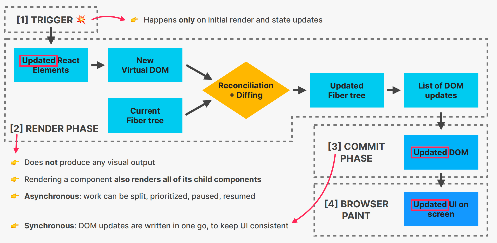


* 更新：同一个位置，被换成了不同的元素，这时候元素的所有子组件的状态会全部丢失。

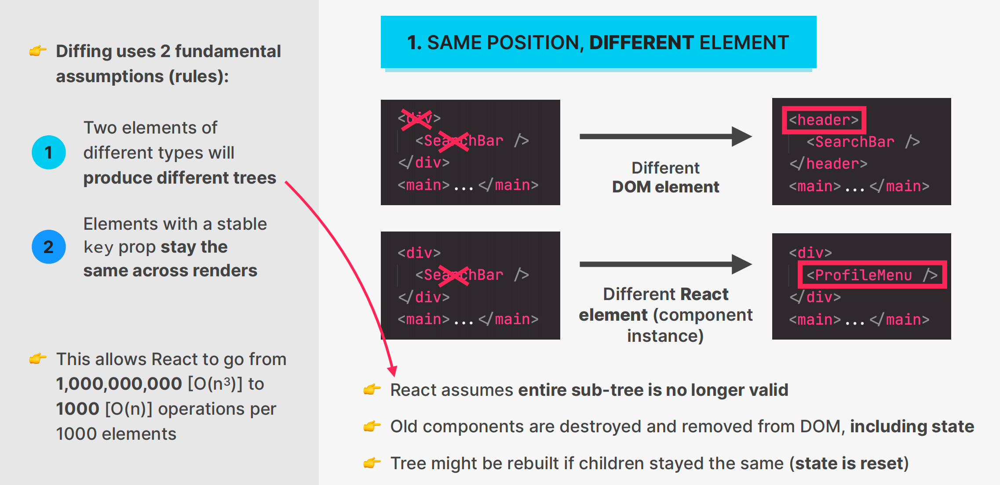

* 更新：同一个位置，同一个元素，只是className或者参数发生了变化，这时候子元素的的状态不会丢失。

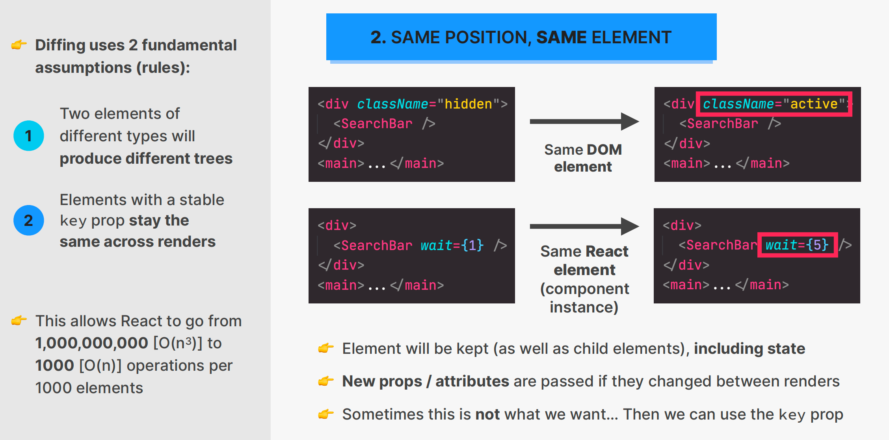


Key参数的作用

* 当元素拥有key时，即使它在树结构中的位置发生变化，也不会销毁再重新创建，这样节省了性能。
  * 结论：在多个相同子元素的地方需要使用key，如map列表创建的组件，不然性能不好。
* 当元素拥有key时，即使它在树结构中位置没有变化，只要key发生了变化，它就会销毁+重新创建。
  * 结论：使用key去销毁状态，即使是同一个元素的只是className或者参数发生了变化。

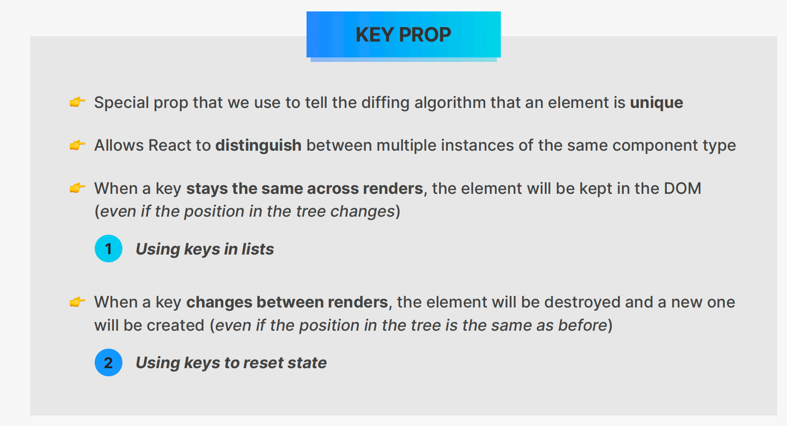

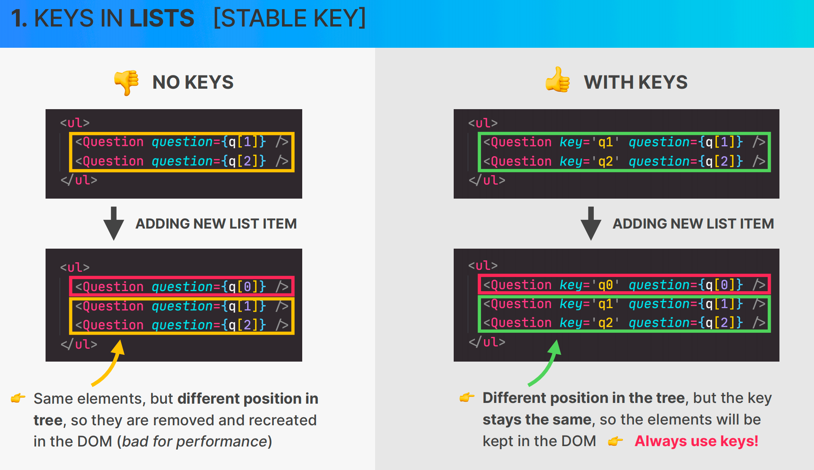

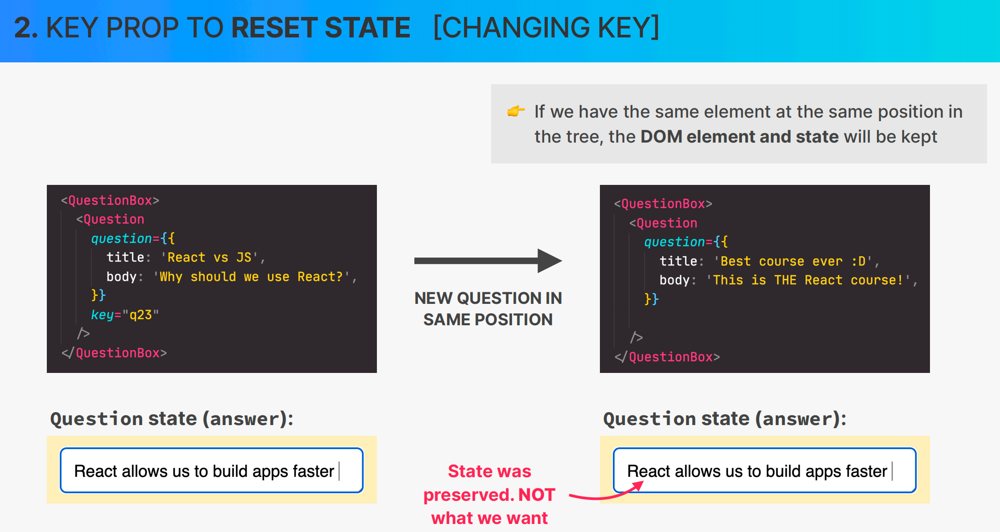

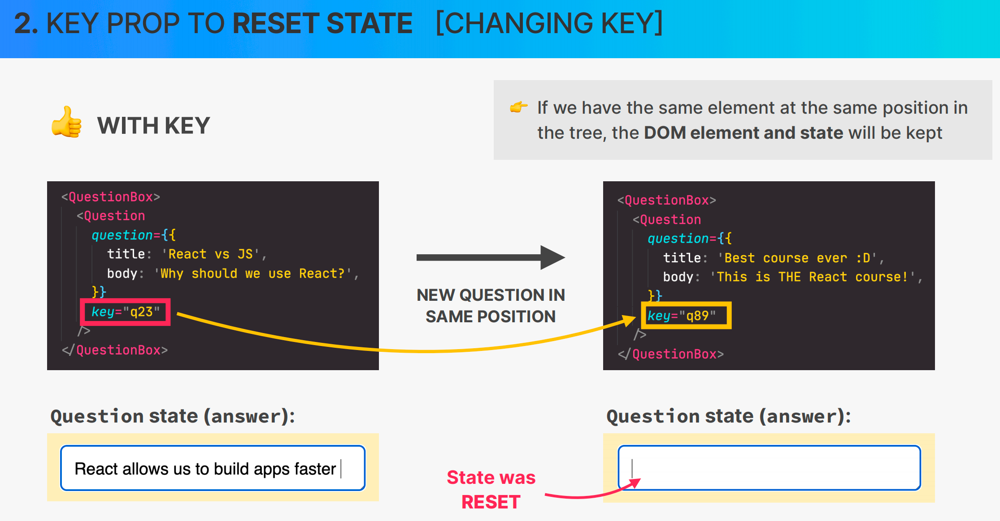


* 两种逻辑在React组件中
  * 渲染逻辑
  * 事件处理函数

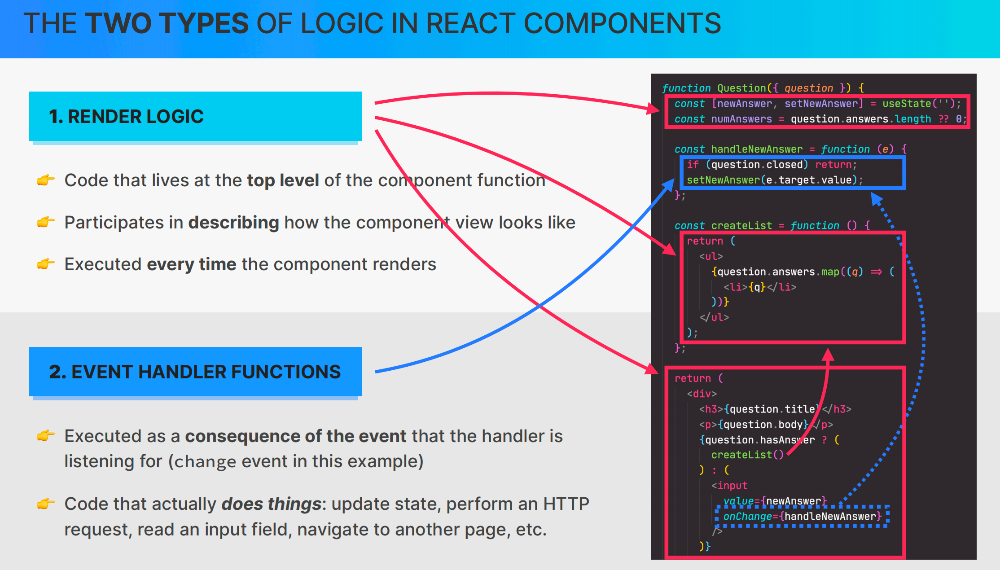

* 函数式编程原则
  * 副作用：函数修改了外部数据，与外部事件产生了交互，像是：外部变量，HTTP请求，写DOM
  * 纯函数：不会修改外部变量，相同input一定获得相同的output。

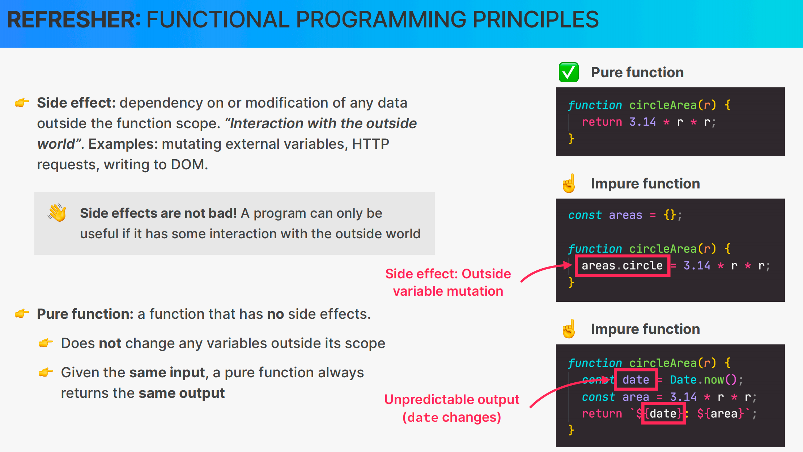


* 在组件的渲染逻辑中，它一定要是纯函数。
* 在渲染逻辑中：
  * 不能做网络请求。
  * 不能开启定时器
  * 不能操作DOM
  * 不能修改外部变量
  * 不能更新state

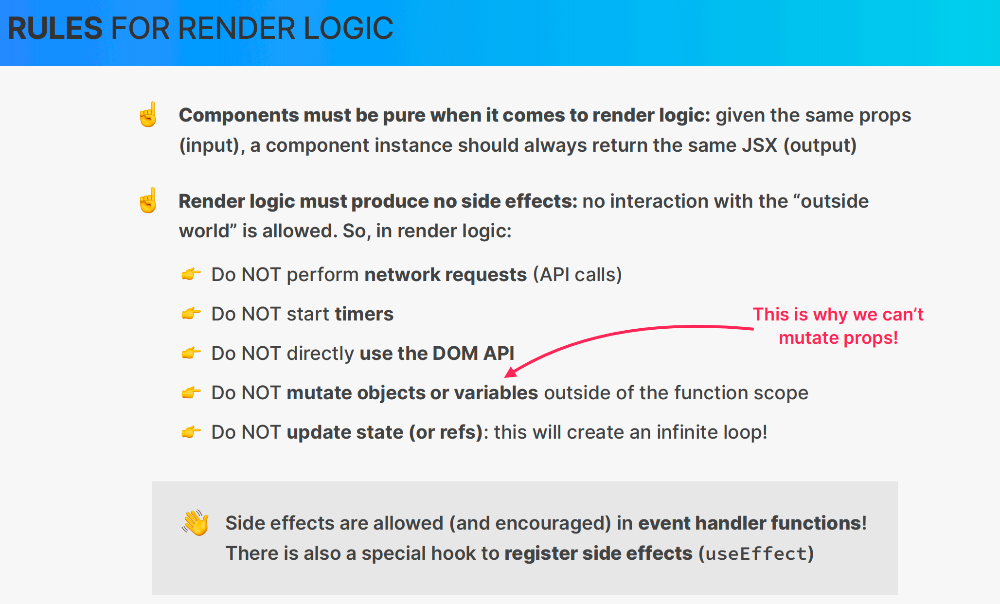


* 所有的更新state在一个函数中，会被打包成一次更新，统一执行。并且这种执行是异步的。

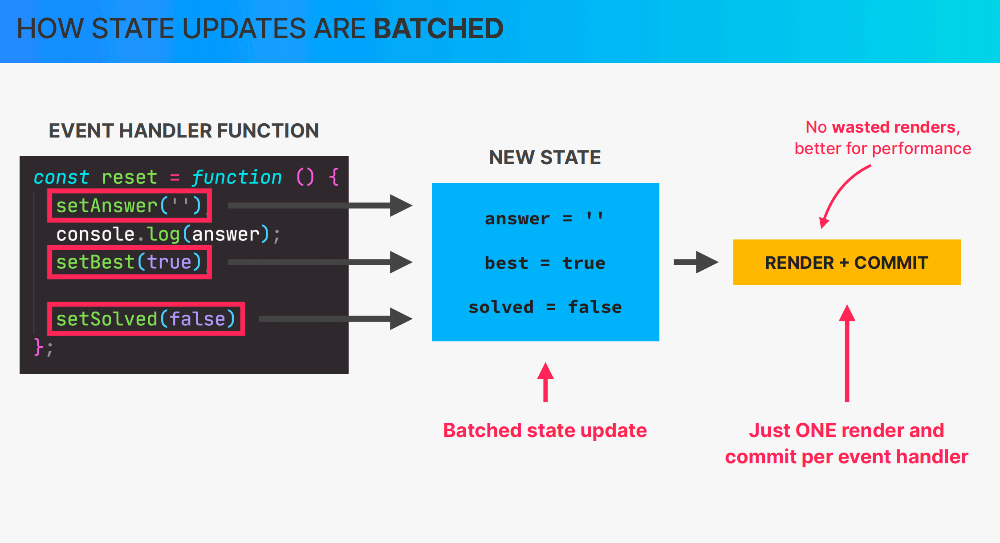

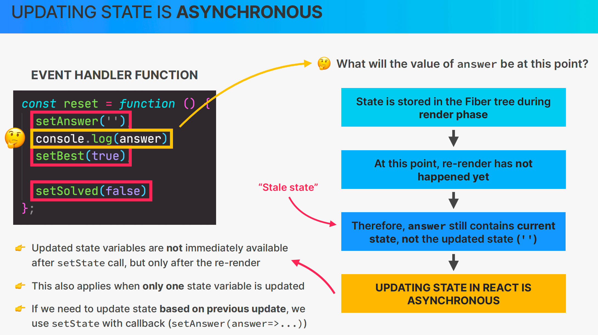


* 这打包统一执行的行为在React17中仅部分支持，React18中完全支持

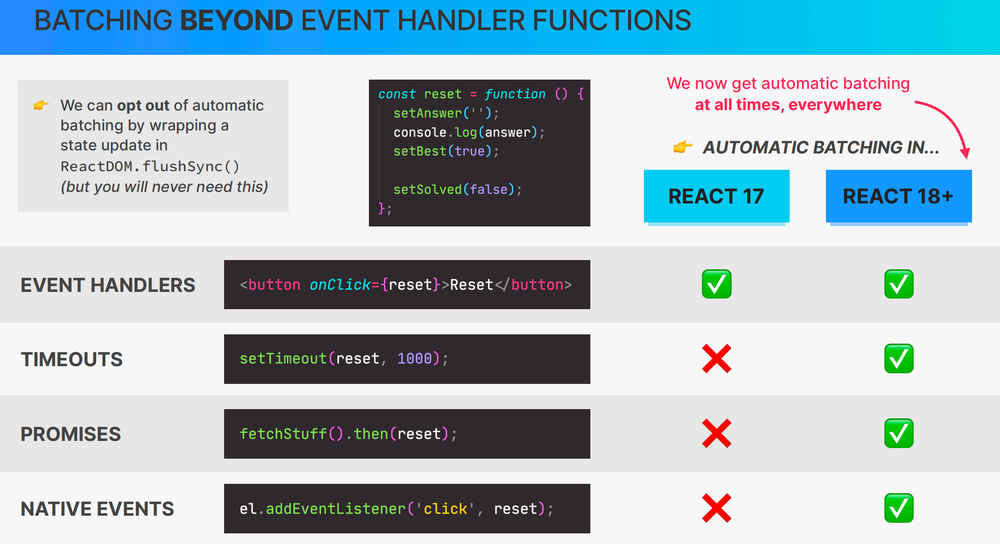


* 当更新state时是基于当前的状态，一定要用回调函数的形式：

```js
function handleTripleInc() {
  setLikes(likes + 1);
  setLikes(likes + 1);
  setLikes(likes + 1);//结果是1
}

function handleTripleInc() {
  setLikes((likes) => likes + 1);
  setLikes((likes) => likes + 1);
  setLikes((likes) => likes + 1);//结果是3
}
```


* 浏览器的事件处理机制
  * 捕获阶段，从上到下
  * 冒泡阶段，从下到上，
  * 我们可以预防冒泡通过e.stopPropagation()函数
  * 事件委托：我们可以把子元素的事件绑定在父元素的事件中处理。

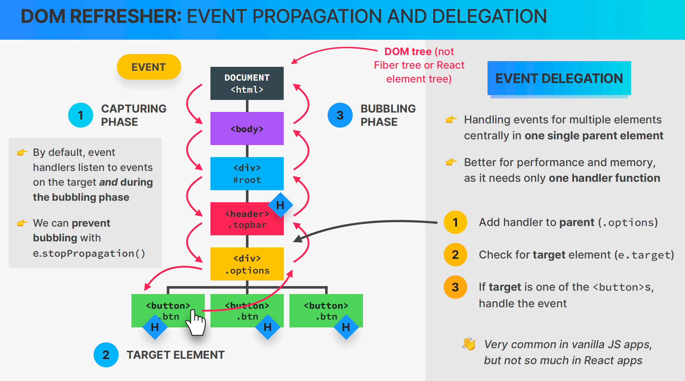


* React事件处理
  * 同样使用事件委托机制：绑定所有事件在root节点上，进行统一处理。

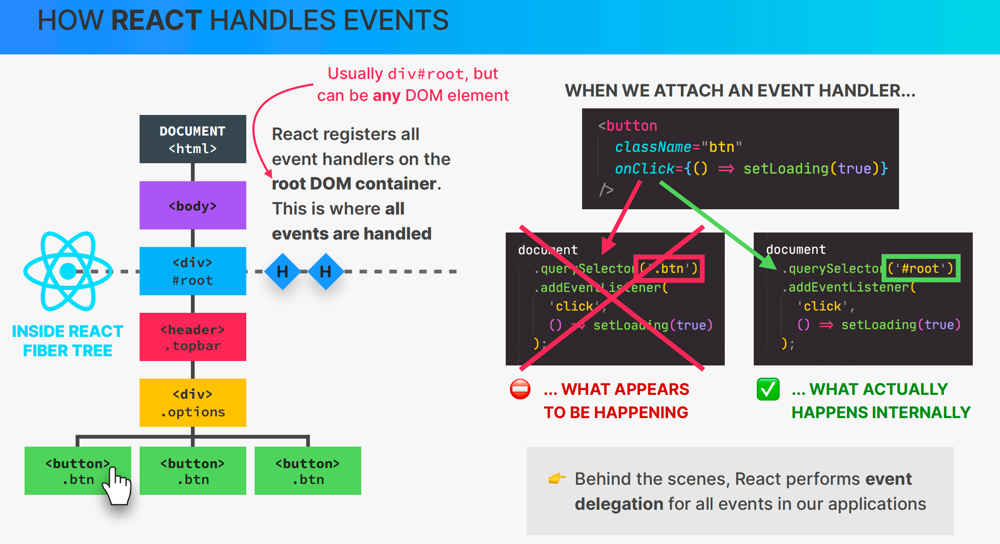


* React的事件和原生js的事件的区别
  * 包裹原生事件
  * 有相同的接口
  * 修复了一些浏览器兼容问题
  * focus，blur，change都会冒泡处理，处理scroll
* 与原生js的区别
  * React用驼峰命名法
  * React使用preventDefault函数预防默认表现
  * React可以添加捕捉事件阶段处理函数：onClickCapture

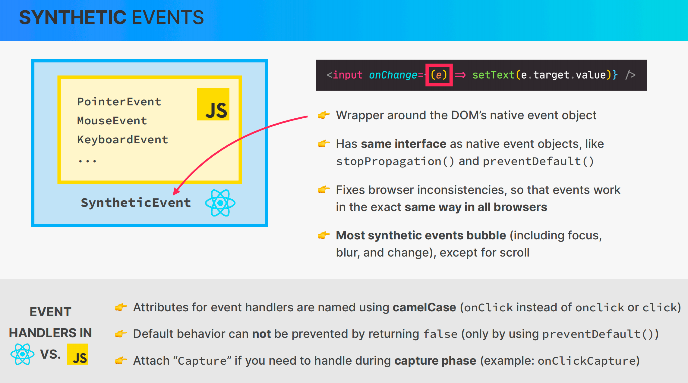


* React是一个库只提供页面渲染的功能，Vue是一个框架，提供整套方案

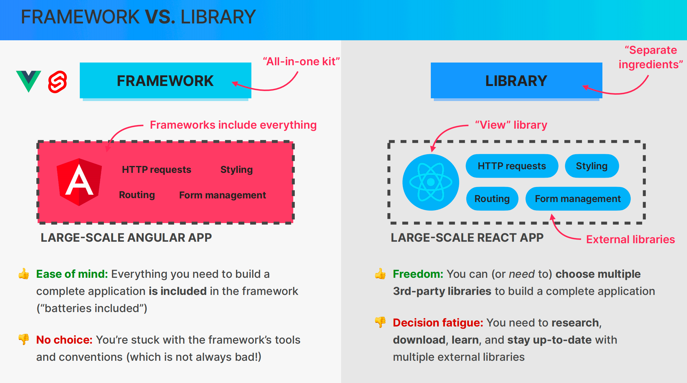


* React需要第三方库实现别的功能

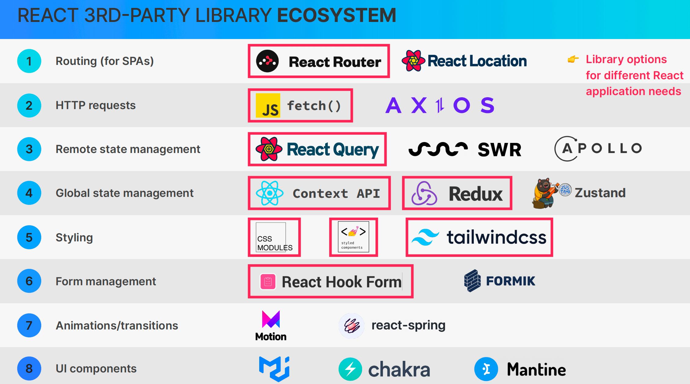


* React也有框架，Nextjs，Remix，Gtsby，甚至有多的功能：SSG，SSR，全栈。

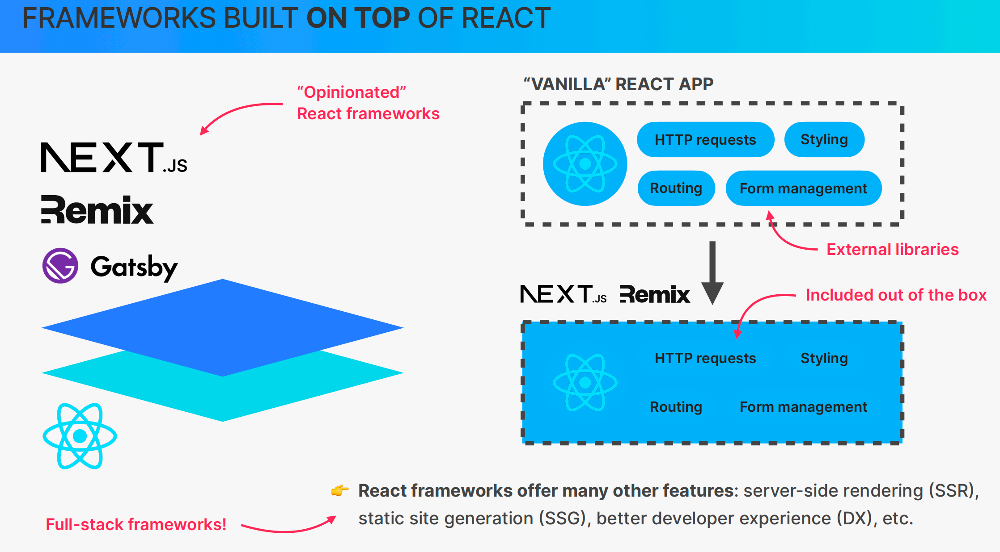


* 不要在组件内部定义新的组件，每次父组件重新渲染，都会导致子组件重新创建，子组件的状态会丢失。

```jsx
function Parent() {
  const [count, setCount] = useState(0);

  // ⚠️ 危险！每次 Parent 渲染都会重新创建 MyButton
  function MyButton() {
    const [innerCount, setInnerCount] = useState(0); // 这个状态会丢失！
    return <button onClick={() => setInnerCount(c => c + 1)}>Clicked {innerCount} times</button>;
  }

  return (
    <div>
      <p>Parent count: {count}</p>
      <button onClick={() => setCount(c => c + 1)}>Increment Parent</button>
      <MyButton /> {/* 每次都“全新”的组件 */}
    </div>
  );
}
```


* 组件的生命周期

  * mount/初次渲染
    * 组件实例第一次创建
    * 新的state，prop创建

  * Re-render/再次渲染
    * 状态发生改变
    * props改变
    * 父组件再次渲染
    * 内容改变

  * Unmount
    * 组件实例销毁
    * state和props销毁

* 我们可以在这些生命周期的每个阶段添加钩子函数。

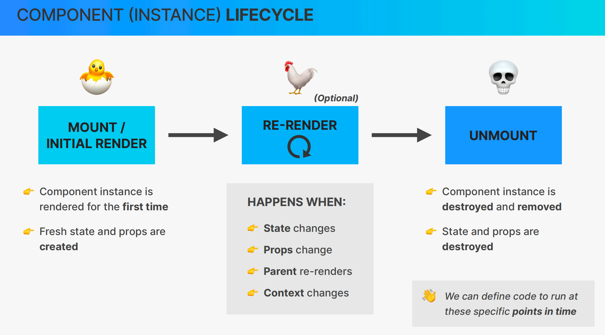


* 产生副作用的方法
  * 事件处理函数：优先考虑使用这种方法，不要过度使用useEffect
  * useEffect：在组件渲染完毕时，在组件卸载时，都可以使用useEffect实现对应时机的函数钩子。


* 网络模块可以使用节流模式，来测试网速差时的页面效果。

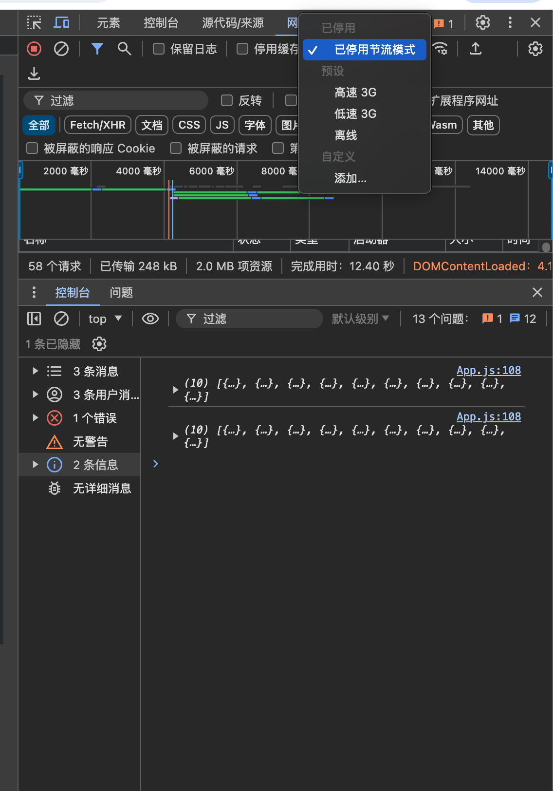


* Try-catch的使用，throw error，当出现网络卡顿时，显示预加载的图示，网络出错显示error。

```jsx
export default function App() {
  const [movies, setMovies] = useState(tempMovieData);
  const [watched, setWatched] = useState(tempWatchedData);
  const [isLoading, setIsLoading] = useState(false);
  const [error, setError] = useState("");
  const query = "interstellar";

  useEffect(function () {
    async function fetchMovies() {
      try {
        setIsLoading(true);
        const res = await fetch(
          `http://www.omdbapi.com/?i=tt3896198&apikey=${KEY}&s=${query}`
        );

        if (!res.ok)
          throw new Error("Something went wrong with feching movies");

        const data = await res.json();
        if (data.Response === "False") throw new Error("Movie not found");

        setMovies(data.Search);
        // console.log(data.Search);
        setIsLoading(false);
      } catch (err) {
        console.log(err.message);
        setError(err.message);
      } finally {
        setIsLoading(false);
      }
    }
    fetchMovies();
  }, []);

  return (
    <>
      <NavaBar>
        <Search />
        <NumResults movies={movies} />
      </NavaBar>

      <Main>
        {isLoading && <Loader />}
        {!isLoading && !error && <MovieList movies={movies} />}
        {error && <ErrorMessage message={error} />}
        <Box>
          <WatchedSummary watched={watched} />
          <WatchedMoviesList watched={watched} />
        </Box>
      </Main>
    </>
  );
}

function Loader() {
  return <p className="loader">Loading...</p>;
}
function ErrorMessage({ message }) {
  return (
    <p className="error">
      <span>⛔️</span>
      {message}
    </p>
  );
}
```


* useEffect的数组的作用
  * 没有数组时，每次重新渲染都会执行effect里的函数
  * 有数组时，数组里的state或者props更新时以及初始渲染都会执行effect里的函数
  * 每一个effect里使用的state和props都必须加入数组。

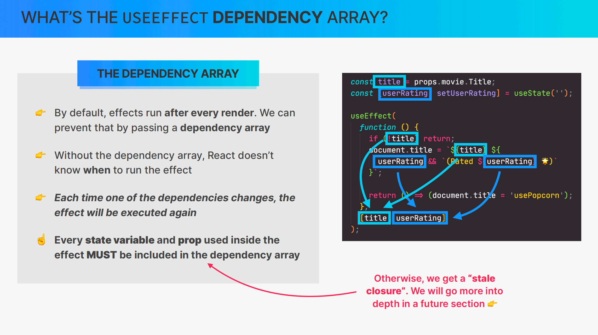

* useEffect是一种与外界同步的手段，以及生命周期钩子


执行时机：

* 有数组+依赖项：在依赖项更新时以及mount后执行effect里的函数。

* 空数组：只在mount后执行effect里的函数。
* 没有数组：每次渲染后都执行effect里的函数。

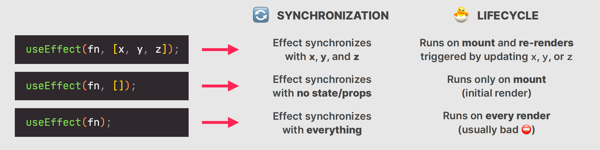

* 每一次在useEffect中执行时，添加setstate的函数都会引发一次重新的组件渲染，所有useEffect应该少用。


* 可以拥有多少effect，每个effect只做一件事

```jsx
  useEffect(
    function () {
      async function getMovieDetails() {
        setIsLoading(true);
        const res = await fetch(
          `http://www.omdbapi.com/?apikey=${KEY}&i=${selectedId}`
        );
        const data = await res.json();
        // console.log(data);
        setMovie(data);
        setIsLoading(false);
      }

      getMovieDetails();
    },
    [selectedId]
  );

  useEffect(
    function () {
      if (!title) return;
      document.title = `Movie | ${title}`;
    },
    [title]
  );
```


* 清理函数，两个清理时机

  * 在effect再次执行前清理

  * 在组件unmount之后清理

    

* 需要清理的功能

  * HTTP请求：取消请求
  * API订阅：取消订阅
  * 执行定时器：停止定时器
  * 添加了事件监听器：移出事件监听器

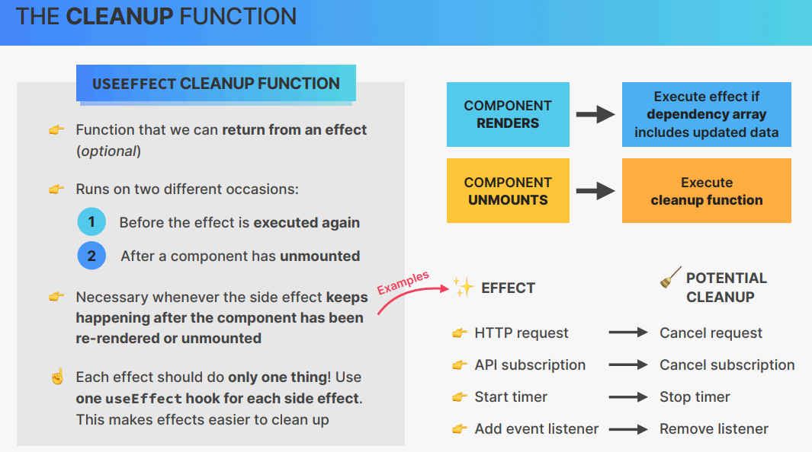


return清理函数：

```jsx
useEffect(
    function () {
      if (!title) return;
      document.title = `Movie | ${title}`;
      return function () {
        document.title = "usePopcorn";
      };
    },
    [title]
);
```


* 使用浏览器api：abortcontroller，在cleanup时取消当前链接。

```jsx
  useEffect(
    function () {
      const controller = new AbortController();
      async function fetchMovies() {
        try {
          setIsLoading(true);
          setError("");
          const res = await fetch(
            `http://www.omdbapi.com/?i=tt3896198&apikey=${KEY}&s=${query}`,
            { signal: controller.signal }
          );

          if (!res.ok)
            throw new Error("Something went wrong with feching movies");

          const data = await res.json();
          if (data.Response === "False") throw new Error("Movie not found");

          setMovies(data.Search);
          // console.log(data.Search);
          setError("");
        } catch (err) {
          console.log(err.message);

          if (err.name !== "AbortEror") {
            setError(err.message);
          }
        } finally {
          setIsLoading(false);
        }
      }

      if (query.length < 3) {
        setMovies([]);
        setError("");
        return;
      }
      fetchMovies();
      return function () {
        controller.abort();
      };
    },
    [query]
  );
```


* cleanup清理addEventListener

```jsx
  useEffect(
    function () {
      function callback(e) {
        if (e.code === "Escape") {
          onCloseMovie();
          console.log("CLOSING");
        }
      }
      document.addEventListener("keydown", callback);

      return function () {
        document.removeEventListener("keydown", callback);
      };
    },
    [onCloseMovie]
  );
```


* 挑战1

```jsx
// `https://api.frankfurter.app/latest?amount=100&from=EUR&to=USD`

import { useState } from "react";
import { useEffect } from "react";

export default function App() {
  const [input, setInput] = useState("USD");
  const [output, setOutput] = useState("USD");
  const [money, setMoney] = useState("100");
  const [result, setResult] = useState("");
  const [error, setError] = useState("");
  const [isLoading, setIsLoading] = useState(false);
  useEffect(
    function () {
      const controller = new AbortController();
      async function fetchOut() {
        try {
          setIsLoading(true);
          setError("");
          const res = await fetch(
            `https://api.frankfurter.app/latest?amount=${money}&from=${input}&to=${output}`,
            { signal: controller.signal }
          );
          console.log(res);

          if (!res.ok && res.status !== 422)
            throw new Error("Something went wrong with feching movies");

          const data = await res.json();

          if (res.status !== 422) {
            setResult(data.rates[output]);
          } else if (data.message === "bad currency pair") {
            setResult(money);
          } else {
            throw new Error("Something went wrong with feching movies");
          }
        } catch (err) {
          if (err.name !== "AbortError") {
            console.log(err.message);
            setError(err.message);
          }
        } finally {
          setIsLoading(false);
        }
      }
      if (input !== output) {
        fetchOut();
      } else {
        setResult(money);
      }
      return function () {
        controller.abort();
      };
    },
    [input, output, money]
  );

  return (
    <div>
      <input
        type="text"
        value={money}
        onChange={(e) => setMoney(e.target.value)}
      />
      <select value={input} onChange={(e) => setInput(e.target.value)}>
        <option value="USD">USD</option>
        <option value="EUR">EUR</option>
        <option value="CAD">CAD</option>
        <option value="INR">INR</option>
      </select>
      <select value={output} onChange={(e) => setOutput(e.target.value)}>
        <option value="USD">USD</option>
        <option value="EUR">EUR</option>
        <option value="CAD">CAD</option>
        <option value="INR">INR</option>
      </select>
      <p>{isLoading ? "Loading" : error !== "" ? error : result}</p>
    </div>
  );
}

```


* 常用hooks

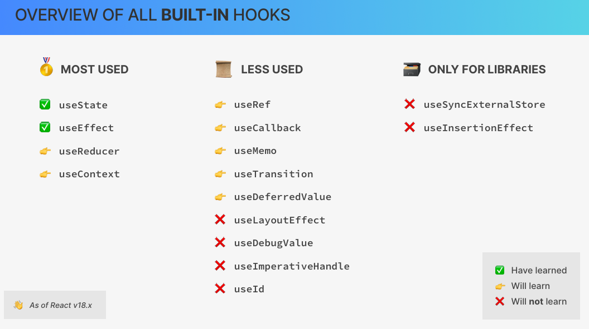

* hooks使用规则
  * 只能在函数顶层调用：不能在if，循环，函数，过早return导致后面的hooks没调用
  * 只能在组件中或者custom hook中调用。

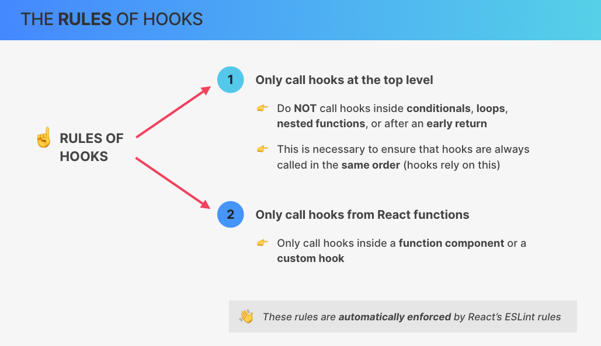


* hooks是存放在Fiber数的的hooks链表中，如果链表中间的hook因为条件消失，回导致链表断掉，所以hook不能在if中使用。

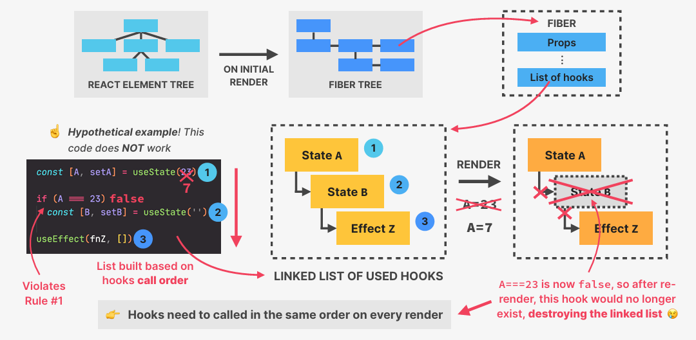


* 这句话imdbRating > 8不会生效，useState只取初始状态作为输入，当imdbRating变化时，不影响useState的初始状态。

```jsx
const [isTop,setIstop] = useState(imdbRating > 8);
```


* 为了得到上一行的设置结果，使用函数形式调用:

```jsx
setAvgRating(Number(imdbRating));
//为了得到上一行的设置结果，使用函数形式调用
setAvgRating((x)=>(x+ userRating)/2);
```


* 数据存取的解决方案：
* useState带一个纯函数<必须是纯函数>进行初始化

```jsx
  const [watched, setWatched] = useState(function () {
    const storedValue = localStorage.getItem("watched");
    return JSON.parse(storedValue);
  });
  
  useEffect(
    function () {
      localStorage.setItem("watched", JSON.stringify(watched));
    },
    [watched]
  );
```


* useState的使用总结

  * 创建时

    * 单值
    * 回调函数，必须是纯函数

  * 设定时

    * 单值
    * 回调函数，必须是纯函数：（需要根据之前的值更新现在的值时使用）

    

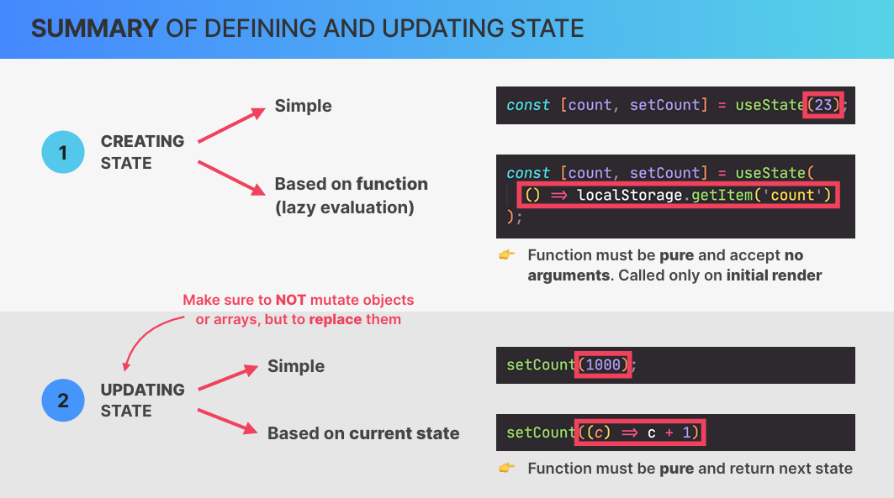


* useRef
  * 创建变量在重复渲染中维持不变。
  * 用于选择存储DOM元素
  * useref是为了那些不用于渲染的data准备的功能，在事件处理函数和effect中使用，不在jsx中使用。

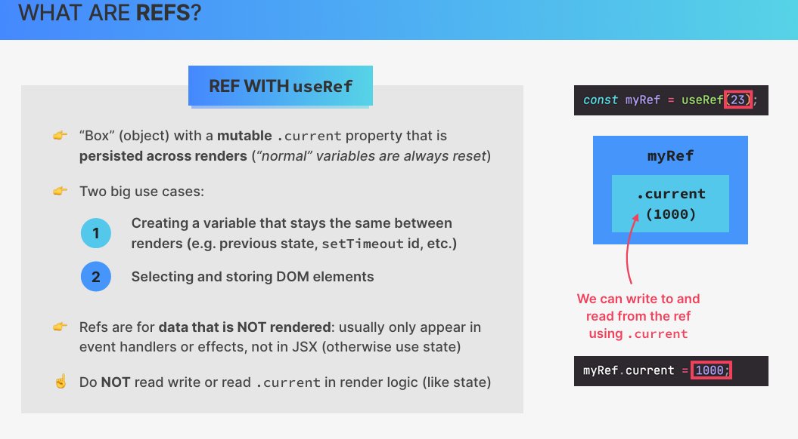


* useRef
  * 多次渲染维持不变
  * 更新不会导致重新渲染
  * 可以更改，通过.current访问
  * 同步更新，在更改后可以立即读取更改后的值。

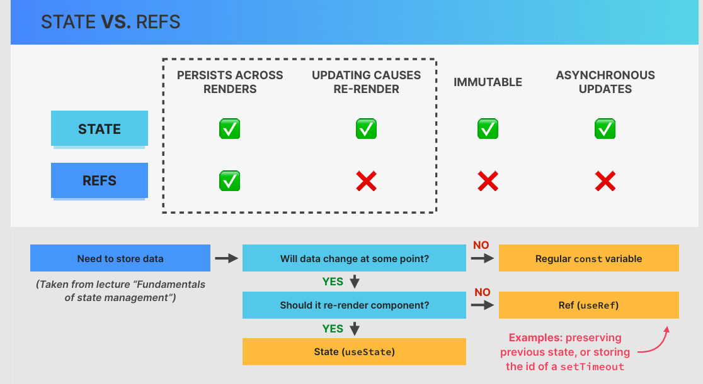


* ref的使用,需要在渲染时不丢失数据的数据，又不需要在jsx中显示时使用ref：

```jsx
const countRef = useRef(0);

useEffect(
  function () {
    if (userRating) countRef.current = countRef.current + 1;
  },
  [userRating]
);
```


* 自定义hooks
  * 可以重用的逻辑函数，并且包含其他hooks的，只能定义成自定义hooks。
  * 它只做一件事。
  * 遵循hooks的规则
  * 函数名需要以use开头
  * 不像组件返回jsx，它返回相关的数据，一般是[]和{}
  * 它就是一个js函数。

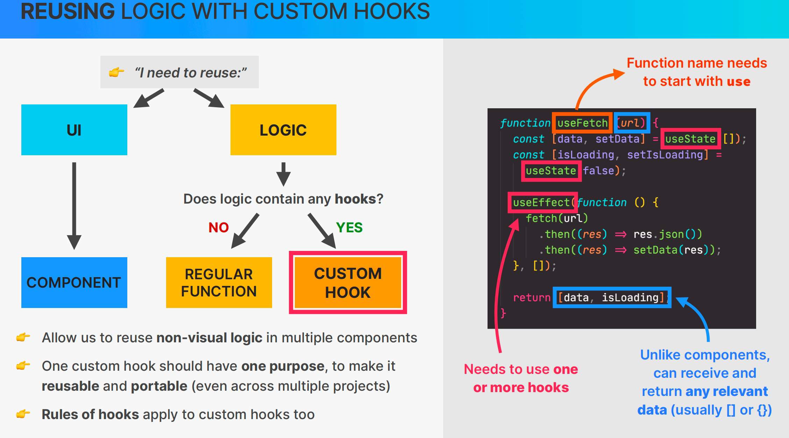


自定义hooks：

```js
import { useState, useEffect } from "react";

const KEY = "8a0c11a1";

export function useMovies(query) {
  const [movies, setMovies] = useState();
  const [isLoading, setIsLoading] = useState(false);
  const [error, setError] = useState("");

  useEffect(
    function () {
      // callback?.();
      const controller = new AbortController();
      async function fetchMovies() {
        try {
          setIsLoading(true);
          setError("");
          const res = await fetch(
            `http://www.omdbapi.com/?i=tt3896198&apikey=${KEY}&s=${query}`,
            { signal: controller.signal }
          );

          if (!res.ok)
            throw new Error("Something went wrong with feching movies");

          const data = await res.json();
          if (data.Response === "False") throw new Error("Movie not found");

          setMovies(data.Search);
          // console.log(data.Search);
          setError("");
        } catch (err) {
          if (err.name !== "AbortError") {
            console.log(err.message);
            setError(err.message);
          }
        } finally {
          setIsLoading(false);
        }
      }

      if (query.length < 3) {
        setMovies([]);
        setError("");
        return;
      }
      // handleCloseMovie();
      fetchMovies();
      return function () {
        controller.abort();
      };
    },
    [query]
  );

  return { movies, setMovies, isLoading, setIsLoading, error, setError };
}
```

```jsx
const { movies, setMovies, isLoading, setIsLoading, error, setError } =
    useMovies(query);
```


* 自定义hook

```jsx
import { useState, useEffect } from "react";
export function useLocalStorageState(initialState, key) {
  const [value, setValue] = useState(function () {
    const storedValue = localStorage.getItem(key);
    return storedValue ? JSON.parse(storedValue) : initialState;
  });

  useEffect(
    function () {
      localStorage.setItem(key, JSON.stringify(value));
    },
    [value, key]
  );

  return [value, setValue];
}
```


* 挑战1：制作自己的hooks

```jsx
import { useState } from "react";

function useGeolocation() {
  const [position, setPosition] = useState({});
  const [error, setError] = useState(null);
  const [isLoading, setIsLoading] = useState(false);
  const { lat, lng } = position;

  function getPositions(params) {
    if (!navigator.geolocation)
      return setError("Your browser does not support geolocation");

    setIsLoading(true);
    navigator.geolocation.getCurrentPosition(
      (pos) => {
        setPosition({
          lat: pos.coords.latitude,
          lng: pos.coords.longitude,
        });
        setIsLoading(false);
      },
      (error) => {
        setError(error.message);
        setIsLoading(false);
      }
    );
  }

  return [lat, lng, isLoading, error, getPositions];
}

export default function App() {
  const [countClicks, setCountClicks] = useState(0);
  [lat, lng, isLoading, error, getPositions] = useGeolocation();

  function getPosition() {
    setCountClicks((count) => count + 1);
    getPositions();
  }

  return (
    <div>
      <button onClick={getPosition} disabled={isLoading}>
        Get my position
      </button>

      {isLoading && <p>Loading position...</p>}
      {error && <p>{error}</p>}
      {!isLoading && !error && lat && lng && (
        <p>
          Your GPS position:{" "}
          <a
            target="_blank"
            rel="noreferrer"
            href={`https://www.openstreetmap.org/#map=16/${lat}/${lng}`}
          >
            {lat}, {lng}
          </a>
        </p>
      )}

      <p>You requested position {countClicks} times</p>
    </div>
  );
}
```


Useful Resources for Part 3

Here are some **high-quality resources** that you might find helpful while studying this Part 3. (The list follows the order of sections in this part)

***These resources are 100% optional, but might give you additional insights or provide ever deeper dives into some topics.\***

👉 [Tao of React - Software Design, Architecture & Best Practices](https://alexkondov.com/tao-of-react/?ref=jonas.io)

👉 [The new wave of React state management](https://frontendmastery.com/posts/the-new-wave-of-react-state-management/?ref=jonas.io) (Excellent read!)

👉 [A Visual Guide to React Rendering - useMemo](https://alexsidorenko.com/blog/react-render-usememo?ref=jonas.io)

👉 [React as a UI Runtime](https://overreacted.io/react-as-a-ui-runtime/?ref=jonas.io) (By Dan Abramov from the React team)

👉 [You Might Not Need an Effect](https://react.dev/learn/you-might-not-need-an-effect?ref=jonas.io) (Official React docs)

👉 [A Complete Guide to useEffect](https://overreacted.io/a-complete-guide-to-useeffect/?ref=jonas.io) (By Dan Abramov)

👉 [useEffect sometimes fires before paint](https://blog.thoughtspile.tech/2021/11/15/unintentional-layout-effect/?ref=jonas.io)

👉 [Making setInterval Declarative with React Hooks](https://overreacted.io/making-setinterval-declarative-with-react-hooks/?ref=jonas.io) (By Dan Abramov)

👉 [Redux - Not Dead Yet!](https://blog.isquaredsoftware.com/2018/03/redux-not-dead-yet/?ref=jonas.io) (By Mark Erikson from the Redux team)

👉 [Why React Context is Not a "State Management" Tool](https://blog.isquaredsoftware.com/2021/01/context-redux-differences/) (By Mark Erikson)


**Library documentation:**

👉 [Vite](https://vitejs.dev/guide/why.html) (Why Vite is so fast)

👉 [CSS Modules](https://github.com/css-modules/css-modules)

👉 [React Router](https://reactrouter.com/en/main?ref=jonas.io)

👉 [React Leaflet: Installation](https://react-leaflet.js.org/docs/start-installation/?ref=jonas.io)

👉 [Redux: Style Guide](https://redux.js.org/style-guide/?ref=jonas.io) (A must-read for Redux users!)

👉 [Redux Toolkit](https://redux-toolkit.js.org/tutorials/overview?ref=jonas.io)

👉 [React Redux](https://react-redux.js.org/api/hooks?ref=jonas.io)


* reducer hooks的使用

```jsx
import { act, useReducer, useState } from "react";

const initialState = { count: 0, step: 1 };
function reducer(state, action) {
  console.log(state, action);
  //return { count: 0, step: 1 };
  // if (action.type === "inc") return state + 1;
  // if (action.type === "dec") return state - 1;
  // if (action.type === "setCount") return action.payload;
  switch (action.type) {
    case "dec":
      return { ...state, count: state.count - state.step };
    case "inc":
      return { ...state, count: state.count + state.step };

    case "setCount":
      return { ...state, count: action.payload };

    case "setStep":
      return { ...state, step: action.payload };
    case "reset":
      return initialState;
    default:
      throw new Error("Unkown action");
  }
}
function DateCounter() {
  //const [count, setCount] = useState(0);
  // const [step, setStep] = useState(1);

  const [state, dispatch] = useReducer(reducer, initialState);
  const { count, step } = state;
  // This mutates the date object.
  const date = new Date("june 21 2027");
  date.setDate(date.getDate() + count);

  const dec = function () {
    // setCount((count) => count - 1);
    //setCount((count) => count - step);
    dispatch({ type: "dec" });
  };

  const inc = function () {
    dispatch({ type: "inc" });
    // setCount((count) => count + 1);
    //setCount((count) => count + step);
  };

  const defineCount = function (e) {
    //setCount(Number(e.target.value));
    dispatch({ type: "setCount", payload: e.target.value });
  };

  const defineStep = function (e) {
    dispatch({ type: "setStep", payload: Number(e.target.value) });
    // setStep(Number(e.target.value));
  };

  const reset = function () {
    //setCount(0);
    // setStep(1);
    dispatch({ type: "reset" });
  };

  return (
    <div className="counter">
      <div>
        <input
          type="range"
          min="0"
          max="10"
          value={step}
          onChange={defineStep}
        />
        <span>{step}</span>
      </div>

      <div>
        <button onClick={dec}>-</button>
        <input value={count} onChange={defineCount} />
        <button onClick={inc}>+</button>
      </div>

      <p>{date.toDateString()}</p>

      <div>
        <button onClick={reset}>Reset</button>
      </div>
    </div>
  );
}
export default DateCounter;
```


* 什么时候使用userReducer

  * 当组件有很多的状态和setter分散在组件中
  * 当许多状态需要在同一个时刻更新，像是开始游戏
  * 当一个状态的更新依赖于其他的很多状态

  

* useReducer
  * 管理复杂的状态
  * 状态存在state中
  * reducer函数包含所有处理状态的逻辑。将逻辑从组件中解耦出来。
  * action代表如何更新状态
  * dispatch函数发送action给reducer
  * reducer必须是纯函数，更新后，页面会重新渲染。

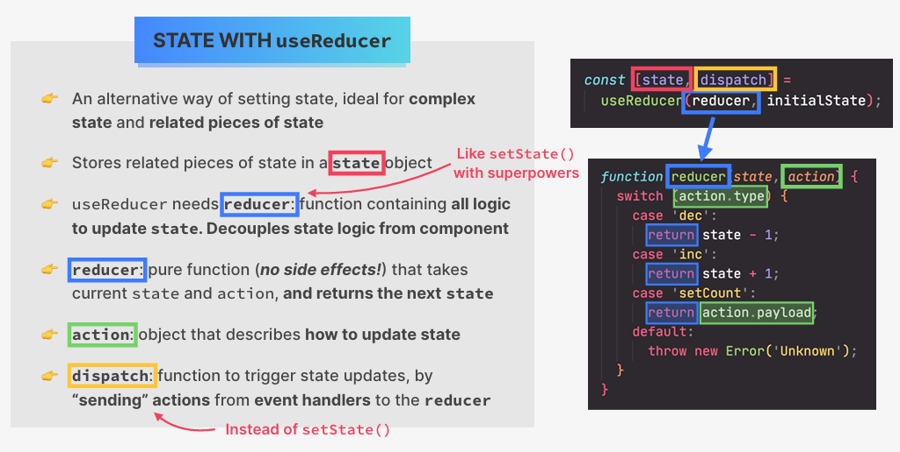


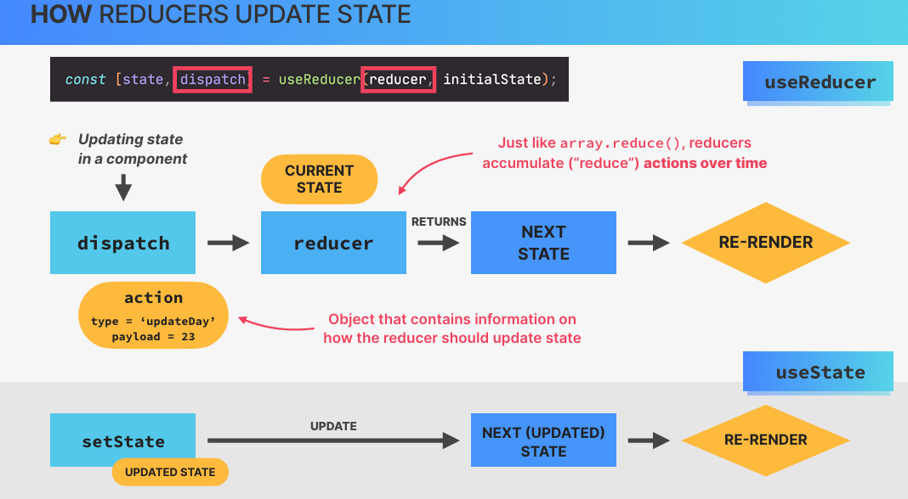


* 使用json-server模拟本地数据到假服务器

```
npm i json-server
```

在package.json中添加命令

```js
  "scripts": {
    "start": "react-scripts start",
    "build": "react-scripts build",
    "test": "react-scripts test",
    "eject": "react-scripts eject",
    "server": "json-server --watch data/questions.json --port 8000"
  },
```

执行

```
npm run server
```


* useReducer实现的状态机

```jsx
const initialState = {
  questions: [],
  //'loading' 'error' 'ready' 'active' 'finished'
  status: "loading",
  index: 0,
  answer: null,
  points: 0,
  highscore: 0,
  secondsRemaining: null,
};
const SECS_PER_QUESTION = 30;
function reducer(state, action) {
  switch (action.type) {
    case "dataReceived":
      return { ...state, questions: action.payload, status: "ready" };
    case "dataFailed":
      return { ...state, status: "error" };

    case "start":
      return {
        ...state,
        status: "active",
        secondsRemaining: state.questions.length * SECS_PER_QUESTION,
      };
    case "newAnswer":
      const question = state.questions[state.index];

      return {
        ...state,
        answer: action.payload,
        points:
          action.payload === question.correctOption
            ? state.points + question.points
            : state.points,
      };
    case "nextQuestion":
      return { ...state, index: state.index + 1, answer: null };

    case "finish":
      return {
        ...state,
        status: "finished",
        highscore:
          state.points > state.highscore ? state.points : state.highscore,
      };

    case "restart":
      return { ...initialState, questions: state.questions, status: "ready" };

    case "tick":
      return {
        ...state,
        secondsRemaining: state.secondsRemaining - 1,
        status: state.secondsRemaining === 0 ? "finished" : state.status,
      };
    default:
      throw new Error("Action unkonwn");
  }
}
```


* Timer的启停：

```jsx
  useEffect(
    function () {
      const id = setInterval(function () {
        // console.log("tick");
        dispatch({ type: "tick" });
      }, 1000);
      return () => clearInterval(id);
    },
    [dispatch]
  );
```


* useState
  * 独立状态
  * 更新分布在事件处理函数和effect中
  * 使用setter更新
  * 命令式更新
  * 易于使用和理解

* useReducer
  * 多个状态捆绑在一起
  * 更新逻辑集中在reducer函数中处理
  * 通过dispatch命令更新状态
  * 声明式更新
  * 较难理解和使用

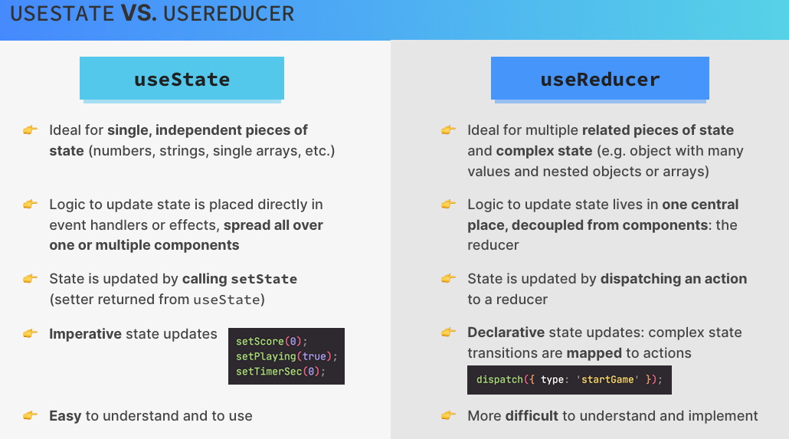


* 只有一个状态？
* 几个状态经常一起更新？
* 3到4个相关的状态，包含对象？
* 太多的event处理函数让组件变大和难以理解？

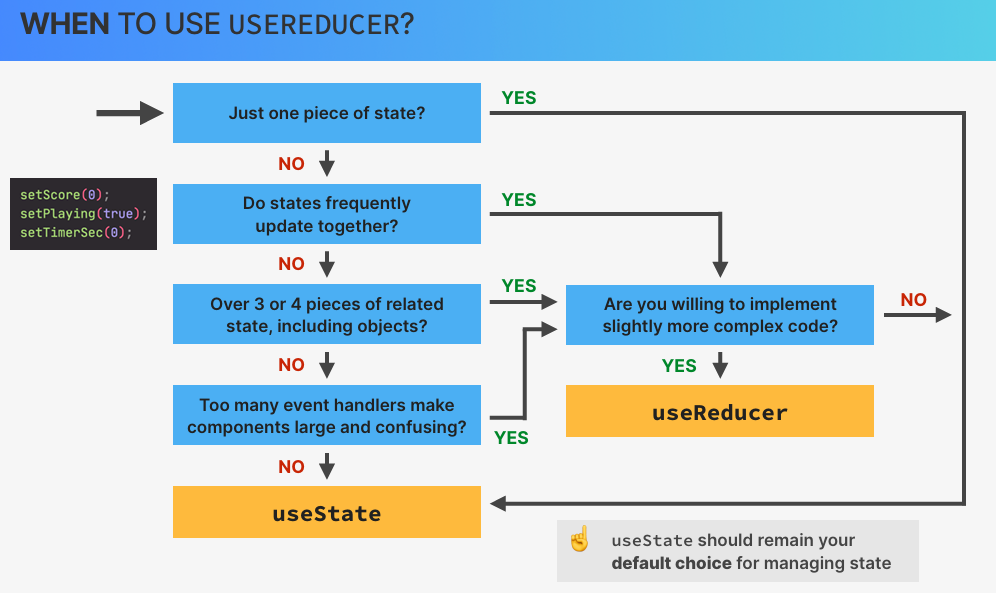


* 挑战：使用useReducer实现一个银行

```jsx
import "./styles.css";
import { useReducer } from "react";
/*
INSTRUCTIONS / CONSIDERATIONS:

1. Let's implement a simple bank account! It's similar to the example that I used as an analogy to explain how useReducer works, but it's simplified (we're not using account numbers here)

2. Use a reducer to model the following state transitions: openAccount, deposit, withdraw, requestLoan, payLoan, closeAccount. Use the `initialState` below to get started.

3. All operations (expect for opening account) can only be performed if isActive is true. If it's not, just return the original state object. You can check this right at the beginning of the reducer

4. When the account is opened, isActive is set to true. There is also a minimum deposit amount of 500 to open an account (which means that the balance will start at 500)

5. Customer can only request a loan if there is no loan yet. If that condition is met, the requested amount will be registered in the 'loan' state, and it will be added to the balance. If the condition is not met, just return the current state

6. When the customer pays the loan, the opposite happens: the money is taken from the balance, and the 'loan' will get back to 0. This can lead to negative balances, but that's no problem, because the customer can't close their account now (see next point)

7. Customer can only close an account if there is no loan, AND if the balance is zero. If this condition is not met, just return the state. If the condition is met, the account is deactivated and all money is withdrawn. The account basically gets back to the initial state
*/

const initialState = {
  balance: 0,
  loan: 0,
  isActive: false,
};

function reducer(state, action) {
  switch (action.type) {
    case "openAccount":
      return { ...state, isActive: true, balance: state.balance + 500 };

    case "Deposit":
      return { ...state, balance: state.balance + 150 };

    case "Withdraw":
      return { ...state, balance: state.balance - 50 };
    case "RequestLoan":
      return {
        ...state,
        balance: state.loan === 0 ? state.balance + 5000 : state.balance,
        loan: state.loan === 0 ? state.loan + 5000 : state.loan,
      };
    case "PayLoan":
      return {
        ...state,
        balance: state.loan > 0 ? state.balance - 5000 : state.balance,
        loan: state.loan > 0 ? state.loan - 5000 : state.loan,
      };

    case "closeAccount":
      return {
        ...state,
        isActive:
          state.balance > 0 && state.loan === 0 ? false : state.isActive,
      };
    default:
      throw new Error("Action unknown");
  }
}

export default function App() {
  const [{ balance, loan, isActive }, dispatch] = useReducer(
    reducer,
    initialState
  );
  return (
    <div className="App">
      <h1>useReducer Bank Account</h1>
      <p>Balance: {balance}</p>
      {loan > 0 && <p>Loan: {loan}</p>}

      <p>
        <button
          onClick={() => {
            dispatch({ type: "openAccount" });
          }}
          disabled={isActive}
        >
          Open account
        </button>
      </p>
      <p>
        <button
          onClick={() => {
            dispatch({ type: "Deposit" });
          }}
          disabled={!isActive}
        >
          Deposit 150
        </button>
      </p>
      <p>
        <button
          onClick={() => {
            dispatch({ type: "Withdraw" });
          }}
          disabled={!isActive}
        >
          Withdraw 50
        </button>
      </p>
      <p>
        <button
          onClick={() => {
            dispatch({ type: "RequestLoan" });
          }}
          disabled={!isActive}
        >
          Request a loan of 5000
        </button>
      </p>
      {loan > 0 && (
        <p>
          <button
            onClick={() => {
              dispatch({ type: "PayLoan" });
            }}
            disabled={!isActive}
          >
            Pay loan
          </button>
        </p>
      )}
      <p>
        <button
          onClick={() => {
            dispatch({ type: "closeAccount" });
          }}
          disabled={!isActive}
        >
          Close account
        </button>
      </p>
    </div>
  );
}
```


* vite安装以及配置eslint

```
npm i eslint vite-plugin-eslint eslint-config-react-app --save-dev 
```

创建.eslintrc.json文件

````
{
  "extends": "react-app"
}
````

在vite.config.js中添加eslint

```js
import { defineConfig } from "vite";
import react from "@vitejs/plugin-react";
import eslint from "vite-plugin-eslint";

// https://vitejs.dev/config/
export default defineConfig({
  plugins: [react(), eslint()],
});
```


* 路由
  * 映射不同URL到不同的UI页面的功能叫做路由
  * 让用户更加不同的URL导航到不同的页面
  * 允许我们构建单页应用


* 单页应用
  * 应用完整运行在客户端
  * 使用路由映射页面
  * 使用js更新dom
  * 页面永远不会重新加载
  * 像是手机app
  * 使用api获取额外的数据

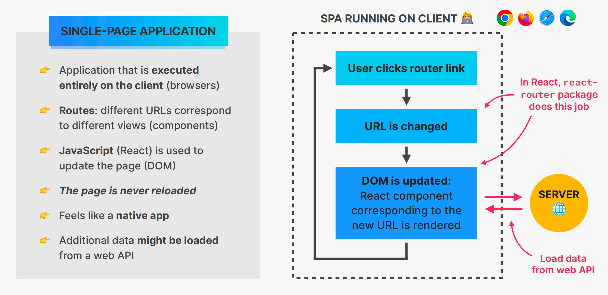


* 安装react-router

```
npm i react-router-dom@6
```


* 使用navlink代替link，当前激活的link会有一个class=active的类

```jsx
import { Link, NavLink } from "react-router-dom";

function PageNav() {
  return (
    <nav>
      <ul>
        <li>
          <NavLink to="/">Homepage</NavLink>
        </li>
        <li>
          <NavLink to="/pricing">pricing</NavLink>
        </li>
        <li>
          <NavLink to="/product">product</NavLink>
        </li>
      </ul>
    </nav>
  );
}
```


* react router的配置：

```jsx
import { BrowserRouter, Routes, Route } from "react-router-dom";
import Product from "./pages/Product";
import Pricing from "./pages/Pricing";
import Homepage from "./pages/Homepage";
import PageNotFound from "./pages/PageNotFound";

function App() {
  return (
    <BrowserRouter>
      <Routes>
        <Route path="/" element={<Homepage />} />
        <Route path="product" element={<Product />} />
        <Route path="pricing" element={<Pricing />} />
        <Route path="*" element={<PageNotFound />} />
      </Routes>
    </BrowserRouter>
  );
}
```


* 在React中css的使用种类：

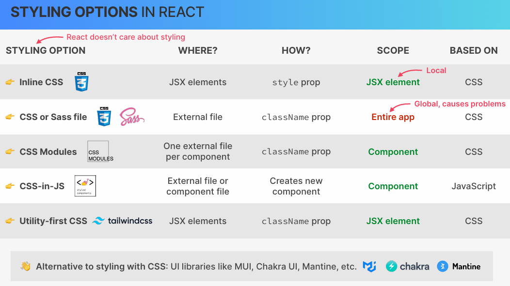


css module中声明全局变量：

```css
:global(.test) {
  background-color: red;
}

//选择class=active的nav，放在添加随机字符，使用global变量
.nav :global(.active) {
  background-color: green;
}
```


* 自动生成css include：添加进snippet里

```js
  "importCSSModule": {
    "prefix": "csm",
    "scope": "javascript,typescript,javascriptreact",
    "body": ["import styles from './${TM_FILENAME_BASE}.module.css'"],
    "description": "Import CSS Module as `styles`"
  },
```

